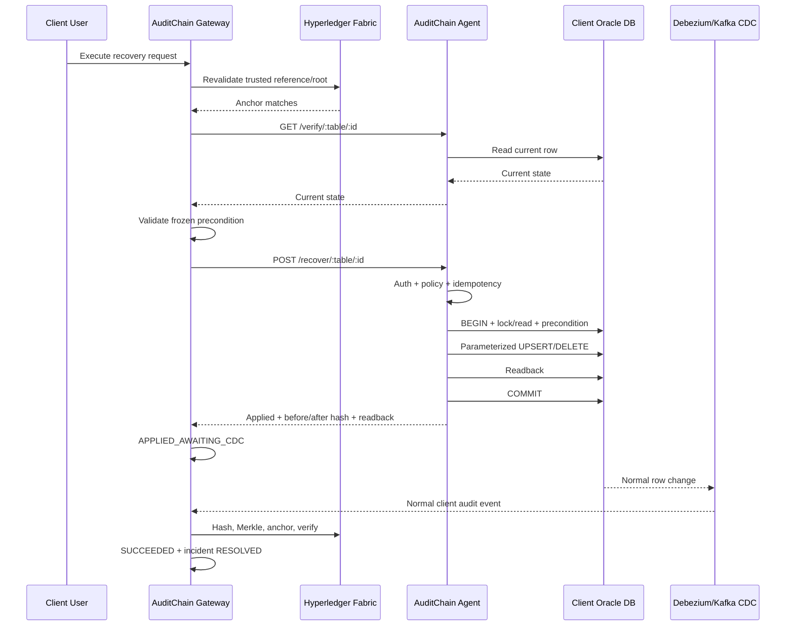

# AuditChain Gateway Agent — Direct Client Database Recovery Implementation Plan

## 1. Status Dokumen

- Status: implementation-ready plan; belum merupakan bukti implementasi atau deployment.
- Target repository: `Auditchain-Gateway-Lab-AI/auditchain-gateway-agent`.
- Baseline yang diaudit: commit `8f683fcf74d2dcf6e34c710022fd667ea4e36d33` (`add verify table`, 2026-09-28).
- Companion plan Gateway: `docs/DIRECT_CLIENT_DB_RECOVERY_IMPLEMENTATION_PLAN.md`.
- Engine pilot: Oracle Database melalui `github.com/sijms/go-ora/v2`.
- Pemilik eksekusi: tim Agent dan tim Gateway harus menyetujui contract test yang sama.

Dokumen ini menjelaskan penambahan kemampuan recovery write pada Agent. Agent
tetap mempertahankan fungsi verifikasi read-only yang sudah ada, tetapi diberi
endpoint write yang sempit, idempoten, terautentikasi, dan hanya dapat menulis
tabel serta kolom yang telah diizinkan secara lokal.

Implementasi dinyatakan selesai hanya setelah seluruh gate pada dokumen ini
lulus. Keberhasilan `go test`, build, atau HTTP `200` Agent saja tidak cukup
untuk menyatakan recovery end-to-end berhasil.

## 2. Ringkasan Audit Baseline

Pada baseline, Agent berada dalam mode `Verify-Only`:

- `main.go` hanya menjalankan verify server;
- endpoint tersedia adalah `GET /verify/:table/:id`,
  `GET /verify-resource/:table/:id`, `GET /table/:table`, dan `GET /health`;
- autentikasi hanya memakai `AGENT_VERIFY_TOKEN`;
- belum ada `POST /recover/:table/:record_id`;
- belum ada `AGENT_RECOVERY_TOKEN`;
- belum ada table/column write allowlist;
- belum ada precondition, transaction write, readback, dan idempotency;
- belum ada contract test recovery;
- package Kafka consumer/publisher tersedia, tetapi tidak dijalankan oleh
  `main.go` pada baseline.

Quality gate baseline berikut lulus, tetapi hanya membuktikan fungsi verify
yang telah tersedia:

```text
go test ./...
go vet ./...
go build ./...
git diff --check
```

## 3. Tujuan Implementasi

Tujuan akhir adalah membuat Agent dapat menerima satu recovery command dari
Gateway dan mengembalikan row database client ke state yang telah dibuktikan
oleh Gateway terhadap PostgreSQL AuditChain, Merkle proof, dan Fabric.

Agent harus:

1. menulis tabel existing pada database client;
2. tidak membuat tabel recovery baru pada database operasional client;
3. tidak menerima arbitrary SQL dari Gateway;
4. menolak write di luar tabel/kolom yang diizinkan;
5. memastikan row belum berubah sejak preflight;
6. menjalankan write dan readback secara transaksional;
7. mencegah duplicate write melalui idempotency durable;
8. menghasilkan perubahan database normal agar Debezium/CDC menangkapnya;
9. tidak menyatakan recovery end-to-end selesai—finalisasi tetap milik
   Gateway setelah CDC, Merkle, dan Fabric confirmation.

## 4. Keputusan Arsitektur yang Dikunci

1. Fabric adalah acuan integritas anchor, bukan penyimpan raw row client.
2. PostgreSQL AuditChain menyimpan audit event, metadata referensi, proof, dan
   lifecycle recovery.
3. Gateway memvalidasi referensi secara penuh sebelum memanggil Agent.
4. Agent adalah satu-satunya komponen recovery yang boleh menulis database
   client.
5. Agent tidak memvalidasi Fabric secara langsung. Agent memvalidasi bentuk
   command, precondition state, policy lokal, dan hasil readback.
6. Gateway tidak mengirim SQL, nama schema bebas, primary-key column bebas,
   atau predicate bebas.
7. Endpoint read menggunakan `AGENT_VERIFY_TOKEN`; endpoint write menggunakan
   `AGENT_RECOVERY_TOKEN` yang berbeda.
8. `client_id` berasal dari konfigurasi lokal Agent, bukan request body.
9. Idempotency state disimpan pada durable Agent-local store, bukan tabel baru
   pada database client.
10. Recovery baru tidak bergantung pada MinIO.
11. HTTP `2xx` dari Agent hanya berarti apply/readback Agent berhasil. Status
    request Gateway tetap `APPLIED_AWAITING_CDC` sampai CDC dan Fabric selesai.
12. Fitur write default-nya nonaktif dan diaktifkan per deployment/pilot.

## 5. Scope

### 5.1 Termasuk

- endpoint recovery write;
- recovery token terpisah;
- Agent-local client identity;
- konfigurasi table/column/primary-key policy;
- canonical state dan hash yang kompatibel dengan Gateway;
- operasi `UPSERT`, `DELETE`, dan defensive `NOOP`;
- optimistic concurrency/precondition;
- Oracle transaction dan parameterized query;
- readback dan hash validation;
- durable idempotency;
- stable error contract;
- request/body/time/column limits;
- structured logging tanpa secret;
- metrics minimum;
- unit, contract, integration, concurrency, dan failure test;
- Docker/Compose, environment example, documentation, rollout, dan rollback.

### 5.2 Di luar scope

- perubahan chaincode Fabric;
- penyimpanan raw payload pada Fabric;
- perubahan orchestrator recovery Gateway selain koreksi contract yang terbukti
  diperlukan oleh contract test;
- pembuatan tabel recovery pada database Oracle client;
- menghapus kompatibilitas endpoint verify lama;
- menghidupkan kembali MinIO;
- recovery arbitrary table tanpa policy eksplisit;
- recovery credential/password pada pilot pertama;
- auto-retry write tanpa pemeriksaan idempotency dan state.

## 6. Arsitektur Target



## 7. Trust Boundary dan Tanggung Jawab

| Komponen | Dipercaya untuk | Tidak dipercaya untuk |
|---|---|---|
| Gateway | tenant JWT, trusted reference, Fabric validation, desired state | menentukan SQL/schema/kolom Agent secara bebas |
| Agent | policy lokal, DB transaction, precondition, idempotency, readback | menyatakan Fabric valid atau recovery final |
| Oracle client DB | constraint dan transaksi row | menjadi sumber trusted reference historis |
| Debezium/Kafka | membawa event perubahan normal | mengotorisasi write recovery |
| Fabric | anchor integritas | menyimpan atau mengembalikan raw row |

Agent harus fail closed ketika command tidak dapat dibuktikan aman. Tidak boleh
ada mode “best effort write”.

## 8. Kontrak HTTP Agent

### 8.1 Endpoint

```text
POST /recover/:table/:record_id
Authorization: Bearer <AGENT_RECOVERY_TOKEN>
Content-Type: application/json
Accept: application/json
```

Path hanya mengidentifikasi resource. Nama schema dan primary-key column tidak
boleh dikirim melalui request; keduanya berasal dari policy lokal Agent.

### 8.2 Request

```json
{
  "request_id": "recovery-request-uuid",
  "idempotency_key": "stable-agent-command-id",
  "operation": "UPSERT",
  "expected_before_hash": "sha3-256-hex",
  "desired_state_hash": "sha3-256-hex",
  "desired_state": {
    "id": 141,
    "nama": "RUANGAN BENAR",
    "aktif": "1"
  },
  "reference": {
    "log_id": "trusted-audit-log-id",
    "audit_leaf_hash": "sha3-256-hex",
    "merkle_root": "sha3-256-hex",
    "anchor_id": "fabric-anchor-id"
  },
  "issued_at": "2026-09-29T00:00:00Z"
}
```

`client_id` sengaja tidak dikirim dalam JSON oleh Gateway. Agent harus membaca
`AGENT_CLIENT_ID` dari konfigurasi lokal dan gagal start bila recovery aktif
tetapi nilai ini kosong.

### 8.3 Response berhasil

```json
{
  "request_id": "recovery-request-uuid",
  "operation": "UPSERT",
  "applied": true,
  "idempotent_replay": false,
  "before_hash": "sha3-256-hex",
  "after_hash": "sha3-256-hex",
  "readback_match": true,
  "found_after": true,
  "checked_at": "2026-09-29T00:00:01Z"
}
```

Aturan response:

- `request_id` harus sama dengan request;
- `after_hash` harus sama dengan `desired_state_hash`;
- `readback_match` harus `true` untuk response sukses;
- `found_after=true` untuk `UPSERT`;
- `found_after=false` untuk `DELETE`;
- replay command yang identik mengembalikan response tersimpan dengan
  `idempotent_replay=true`;
- body response tidak boleh mengembalikan row penuh atau secret column.

### 8.4 Stable error contract

Format:

```json
{
  "code": "source_state_changed",
  "message": "current state no longer matches recovery precondition"
}
```

| HTTP | Code | Kondisi |
|---:|---|---|
| 400 | `invalid_payload` | JSON, field, operation, UUID, hash, atau waktu tidak valid |
| 400 | `desired_state_invalid` | desired state bukan object atau tidak sesuai PK/path |
| 401 | `invalid_agent_token` | recovery token kosong/salah |
| 403 | `recovery_disabled` | write feature tidak aktif |
| 403 | `table_not_allowed` | tabel tidak terdapat pada policy |
| 403 | `column_not_allowed` | desired state mengandung kolom terlarang |
| 404 | `resource_mapping_not_found` | table/PK mapping tidak tersedia |
| 409 | `source_state_changed` | current hash berbeda dari precondition |
| 409 | `idempotency_conflict` | key sama, semantic command berbeda |
| 409 | `command_in_progress` | command identik sedang diproses |
| 422 | `write_rejected` | Oracle constraint/validation menolak |
| 500 | `readback_mismatch` | write terjadi tetapi readback tidak cocok; transaksi rollback |
| 500 | `idempotency_store_failed` | state durable Agent tidak dapat disimpan |
| 503 | `database_unreachable` | Oracle tidak dapat dijangkau |
| 503 | `execution_outcome_unknown` | crash/retry tidak dapat menentukan outcome dengan aman |

Pesan internal Oracle tidak dikembalikan apa adanya kepada caller.

## 9. Konfigurasi Agent

Tambahkan environment berikut:

```text
AGENT_RECOVERY_ENABLED=false
AGENT_CLIENT_ID=67e493e9-f7a1-441a-8229-f688cb876fd2
AGENT_RECOVERY_TOKEN=<secret-random-minimum-32-bytes>
AGENT_RECOVERY_STATE_PATH=/var/lib/auditchain-agent/recovery-state.db
AGENT_RECOVERY_MAX_BODY_BYTES=1048576
AGENT_RECOVERY_MAX_COLUMNS=64
AGENT_RECOVERY_MAX_CLOCK_SKEW_SECONDS=300
AGENT_RECOVERY_REQUEST_TIMEOUT_SECONDS=15
AGENT_RECOVERY_RETENTION_DAYS=90
AGENT_RECOVERY_POLICY_PATH=/app/recovery-policy.yml
```

Aturan startup:

- bila `AGENT_RECOVERY_ENABLED=false`, endpoint recovery mengembalikan `403`
  atau tidak didaftarkan; verify tetap berjalan;
- bila recovery aktif, `AGENT_CLIENT_ID`, recovery token, state path, dan policy
  wajib tersedia;
- verify token dan recovery token wajib berbeda;
- token tidak boleh dicetak ke log;
- state directory harus writable oleh user non-root container;
- konfigurasi policy invalid harus menggagalkan startup recovery;
- production wajib memakai TLS/mTLS atau private authenticated tunnel yang
  disetujui operator.

## 10. Recovery Policy Lokal

Write policy tidak boleh memakai wildcard. Contoh awal:

```yaml
version: 1
tables:
  - resource_table: RUANGAN
    schema: POLINEMA
    table: RUANGAN
    primary_key_field: id
    primary_key_column: ID
    primary_key_type: string
    operations: [UPSERT, DELETE]
    columns:
      id:
        database_column: ID
        state: true
        insert: true
        update: false
        immutable: true
      nama:
        database_column: NAMA
        state: true
        insert: true
        update: true
      aktif:
        database_column: AKTIF
        state: true
        insert: true
        update: true
      id_unit:
        database_column: ID_UNIT
        state: true
        insert: true
        update: true
      created_at:
        database_column: CREATED_AT
        state: true
        insert: true
        update: false
        immutable: true
      updated_at:
        database_column: UPDATED_AT
        state: true
        insert: true
        update: true
      user_input:
        database_column: USER_INPUT
        state: true
        insert: true
        update: false
      user_updated:
        database_column: USER_UPDATED
        state: true
        insert: true
        update: true
```

Aturan policy:

1. mapping resource table bersifat exact dan case-normalized;
2. schema/table/PK berasal dari policy, bukan request;
3. key desired state berasal dari canonical Gateway sehingga memakai lowercase;
   `columns.<canonical_field>.database_column` memetakan key tersebut ke
   identifier Oracle yang exact, misalnya `nama -> NAMA`;
4. dua canonical field tidak boleh menunjuk database column yang sama;
5. primary key pada desired state harus sama dengan `record_id` path;
6. field tidak dikenal ditolak, bukan diabaikan;
7. generated, virtual, identity, credential, password, token, dan binary/LOB
   column diblokir;
8. seluruh entry dengan `state=true` harus sama dengan projection audit
   metadata dan verify read;
9. primary key boleh dipakai pada `INSERT`, tetapi tidak boleh diubah pada
   `UPDATE`;
10. pilot pertama memakai tabel non-sensitif, misalnya `RUANGAN`; tabel `USERS`
   tidak diaktifkan sebelum policy credential/redaction disetujui;
11. perubahan policy harus direview seperti perubahan kode;
12. hash policy dapat dicatat saat startup untuk audit, tanpa mencetak secret.

## 11. Canonical State dan Hash

Agent harus kompatibel byte-for-byte dengan `pkg/canonicalstate` Gateway.

### 11.1 Schema version

```text
canonical schema version = 1
```

### 11.2 Normalization

- JSON diparse menggunakan number-preserving decoder;
- key object di-trim dan dijadikan lowercase secara rekursif;
- collision setelah normalization ditolak;
- object key diurutkan deterministik;
- `1`, `1.0`, dan `1e0` harus menghasilkan representasi yang sama;
- large integer tidak boleh dikonversi melalui `float64`;
- array mempertahankan urutan;
- trailing JSON ditolak;
- database date/timestamp dikonversi ke representasi yang telah disepakati
  contract test, bukan bergantung locale driver.

### 11.3 Hash preimage

```text
1|<AGENT_CLIENT_ID>|<TABLE:RECORD_ID>|<canonical-json>
```

Hash:

```text
SHA3-256(preimage), lowercase hexadecimal 64 karakter
```

Agent harus merekonstruksi resource dari path yang telah divalidasi:

```text
resource = table + ":" + record_id
```

Agent dan Gateway wajib memakai golden test vectors yang sama. Jangan membuat
implementasi normalisasi kedua yang hanya “mirip”. Salin package yang sama atau
ekstrak module shared setelah compatibility test tersedia.

## 12. Durable Idempotency

Idempotency tidak boleh disimpan pada tabel baru di Oracle client. Rekomendasi
untuk implementasi pertama adalah embedded BoltDB pada volume Agent:

```text
/var/lib/auditchain-agent/recovery-state.db
```

Record minimum:

```text
idempotency_key
request_id
semantic_fingerprint
resource
operation
status: IN_PROGRESS | COMPLETED | FAILED_SAFE | OUTCOME_UNKNOWN
before_hash
after_hash
stored_response
created_at
updated_at
expires_at
```

`semantic_fingerprint` mencakup field stabil:

- request ID;
- idempotency key;
- operation;
- expected-before hash;
- desired-state hash;
- canonical desired state;
- reference log/leaf/root/anchor;
- resource hasil path.

`issued_at` tidak dimasukkan ke semantic fingerprint karena Gateway membentuk
waktu baru saat retry execute. `issued_at` tetap diperiksa freshness pada
penerimaan command pertama.

Algoritma:

1. buka transaksi idempotency store;
2. key belum ada: simpan `IN_PROGRESS` dan fingerprint sebelum DB write;
3. key ada dan fingerprint berbeda: `409 idempotency_conflict`;
4. key ada dan `COMPLETED`: kembalikan response tersimpan dengan replay flag;
5. key ada dan `IN_PROGRESS` setelah restart/crash:
   - baca current database state;
   - bila sudah sama dengan desired result, finalisasi sebagai replay;
   - bila masih sama dengan before state, command boleh dilanjutkan satu kali;
   - selain itu set `OUTCOME_UNKNOWN` dan fail closed;
6. setelah transaction Oracle commit, simpan `COMPLETED` beserta response;
7. bila penyimpanan completion gagal setelah commit, jangan blind retry; gunakan
   reconciliation rule di atas;
8. retention cleanup hanya menghapus record terminal yang melewati retention
   dan tidak boleh menghapus command aktif.

Perlu resource-keyed mutex lokal untuk mencegah dua goroutine Agent menulis row
yang sama. Constraint dan transaction Oracle tetap menjadi lapisan kedua.

## 13. Algoritma Execute Agent

### 13.1 Request boundary

1. tolak selain `POST`;
2. batasi body dengan `http.MaxBytesReader`;
3. verifikasi recovery enabled;
4. validasi bearer token menggunakan constant-time comparison;
5. parse tepat dua path segment dan URL-decode;
6. decode JSON dengan `DisallowUnknownFields`;
7. tolak trailing JSON;
8. validasi UUID/request ID, operation, seluruh hash, reference, dan `issued_at`;
9. load exact table policy;
10. validasi jumlah dan nama kolom;
11. bentuk resource dan semantic fingerprint;
12. jalankan idempotency decision.

### 13.2 Read current state

1. resolve schema/table/PK/state columns dari policy;
2. gunakan quoted identifier yang berasal dari policy tervalidasi;
3. seluruh value menggunakan bind parameter Oracle;
4. untuk row existing gunakan `SELECT ... FOR UPDATE` dalam transaction;
5. canonicalize projection;
6. hitung current hash menggunakan `AGENT_CLIENT_ID` dan resource;
7. bila hash berbeda dari `expected_before_hash`, rollback dan return
   `409 source_state_changed`;
8. jangan menulis bila precondition gagal.

### 13.3 UPSERT

Row existing:

- update hanya `update_columns`;
- PK dan immutable field tidak berubah;
- pastikan affected row tepat satu.

Row missing:

- insert hanya `insert_columns`;
- PK desired state wajib sama dengan path;
- constraint conflict menyebabkan rollback dan read ulang sebelum menentukan
  `source_state_changed` atau `write_rejected`.

Jangan memakai query string dari caller. Dynamic identifier hanya berasal dari
policy yang telah tervalidasi saat startup.

### 13.4 DELETE

- `desired_state` boleh tidak dikirim karena Gateway memakai `omitempty`, atau
  berupa object kosong; Agent menormalisasi keduanya menjadi `{}`;
- row harus ada dan current hash cocok dengan precondition;
- delete dengan exact primary key;
- affected row harus satu;
- readback wajib memastikan row tidak ada;
- after hash adalah canonical hash object kosong `{}`;
- row yang sudah hilang tanpa replay record bukan success tersembunyi;
  kembalikan `409 source_state_changed`. `recovery_not_required` seharusnya
  sudah diputuskan Gateway sebelum command write dikirim.

### 13.5 NOOP defensif

Gateway normalnya tidak mengirim `NOOP` karena request tidak dibuat jika state
sudah benar. Bila Agent menerima `NOOP`:

- tidak ada write;
- current state tetap harus dibaca dan di-hash;
- hanya berhasil bila current hash sama dengan desired state hash;
- hasil disimpan idempoten;
- `applied=false`, `readback_match=true`.

### 13.6 Readback dan commit

1. baca ulang state menggunakan projection yang sama;
2. canonicalize dan hash;
3. bandingkan dengan `desired_state_hash`;
4. bila berbeda, rollback dan `readback_mismatch`;
5. bila cocok, commit Oracle transaction;
6. simpan idempotency completion;
7. return response tanpa raw row;
8. jangan mengirim callback “SUCCEEDED” ke Gateway; CDC yang akan
   mengkonfirmasi perubahan.

## 14. Struktur Package yang Disarankan

```text
internal/
  canonicalstate/
    canonical.go
    canonical_test.go
    vectors_test.go
  recovery/
    types.go
    errors.go
    config.go
    policy.go
    auth.go
    handler.go
    service.go
    oracle_repository.go
    idempotency.go
    resource_lock.go
    redaction.go
    *_test.go
  verify/
    verify.go
    verify_test.go
```

Perubahan file utama:

| File/area | Perubahan |
|---|---|
| `main.go` | load recovery config, validate startup, wire recovery service dan graceful HTTP shutdown |
| `internal/config/config.go` | recovery env/config dan strict validation |
| `internal/verify` | reuse read projection; bedakan not-found dan DB failure |
| `internal/recovery/types.go` | request/response/error DTO contract |
| `internal/recovery/policy.go` | exact allowlist serta PK/schema mapping |
| `internal/recovery/oracle_repository.go` | transaction, lock, parameterized UPSERT/DELETE/readback |
| `internal/recovery/idempotency.go` | durable command state dan crash reconciliation |
| `internal/recovery/handler.go` | HTTP boundary, auth, limit, stable error mapping |
| `docker-compose.yml` | recovery env, read-only policy mount, writable state volume |
| `Dockerfile` | persistent directory permission untuk UID 1000 |
| `.env.example` | placeholder non-secret dan recovery disabled default |
| `DOCUMENTATION.md` | contract, configuration, rollout, troubleshooting |

## 15. Perbaikan Verify Endpoint yang Harus Ikut Dikerjakan

Direct recovery bergantung pada read yang benar. Karena itu:

1. error query/database tidak boleh dikembalikan sebagai `found:false` HTTP
   `200`; gunakan error terstruktur `503 database_unreachable`;
2. `found:false` hanya berarti query valid dan row memang tidak ada;
3. `/table/:table` harus dihapus, dinonaktifkan default, atau dibatasi policy
   serta pagination karena saat ini dapat mengembalikan seluruh tabel;
4. verify endpoint menggunakan table read allowlist;
5. response memiliki ukuran maksimum;
6. request memiliki timeout;
7. table lookup tidak boleh bebas memilih schema lain hanya karena nama tabel
   sama;
8. database error detail hanya dicatat ter-redact;
9. `http.Server` memakai read-header/read/write/idle timeout dan graceful
   shutdown;
10. health dibedakan menjadi liveness dan readiness bila diperlukan.

## 16. Security Controls

Wajib sebelum staging:

- recovery disabled by default;
- verify/recovery token berbeda;
- token acak minimum 256 bit, rotatable, tidak disimpan Git;
- constant-time token comparison;
- TLS/mTLS atau authenticated private tunnel;
- exact table/column/schema allowlist;
- tidak ada arbitrary SQL;
- parameterized values;
- body, response, column count, dan execution timeout limit;
- clock-skew validation;
- resource-level concurrency lock;
- Oracle least-privilege account hanya untuk tabel pilot;
- secret/credential column diblokir;
- response dan log tidak memuat full desired state, password, atau token;
- state store permission hanya user Agent;
- audit log terstruktur mencatat request ID, resource tersanitasi, operation,
  duration, result code, dan replay flag;
- rate limit endpoint recovery;
- production network hanya menerima koneksi dari Gateway yang sah;
- dependency dan container image dipindai sebelum rollout.

## 17. Observability

Log minimum tanpa payload sensitif:

```text
request_id
idempotency_key_hash
resource
operation
result_code
idempotent_replay
duration_ms
before_hash_prefix
after_hash_prefix
```

Metrics minimum:

- `agent_recovery_requests_total{operation,result}`;
- `agent_recovery_duration_seconds{operation}`;
- `agent_recovery_precondition_conflict_total`;
- `agent_recovery_idempotent_replay_total`;
- `agent_recovery_readback_mismatch_total`;
- `agent_recovery_database_error_total`;
- `agent_recovery_in_progress`;
- `agent_recovery_policy_rejection_total{reason}`.

Token, password database, full row, dan full desired state tidak boleh masuk
log atau metric label.

## 18. Test Strategy

### 18.1 Shared golden vectors

Gateway dan Agent menjalankan file vector yang sama untuk:

- uppercase/lowercase key;
- whitespace key;
- nested object;
- array;
- `1`, `1.0`, dan `1e0`;
- large integer;
- null, boolean, empty string;
- timestamp representation;
- duplicate normalized key;
- tenant/resource hash separation;
- empty object untuk DELETE.

### 18.2 Unit test

- configuration validation;
- recovery disabled behavior;
- token separation dan auth;
- path parsing;
- unknown/trailing JSON rejection;
- request size/column/time limits;
- policy exact match;
- PK equality;
- generated/credential column rejection;
- SQL identifier validation;
- operation resolver;
- canonicalization/hash;
- stable error mapping;
- semantic fingerprint excludes `issued_at`;
- idempotency identical replay;
- idempotency conflict;
- stale in-progress reconciliation;
- redaction;
- verify DB error versus row missing.

### 18.3 Repository integration test

Gunakan interface repository untuk fast tests dan Oracle staging/container yang
disetujui untuk engine-specific tests:

- update existing row;
- insert missing row;
- delete existing row;
- missing delete;
- transaction rollback pada constraint failure;
- rollback pada readback mismatch;
- row berubah antara read dan write;
- concurrent command resource yang sama;
- large numeric/date/null round-trip;
- quoted Oracle identifier;
- permission denied;
- database disconnected/timeout.

### 18.4 HTTP contract test

- exact request dari Gateway berhasil;
- response field exact dan tidak bocor raw row;
- wrong verify token tidak dapat write;
- wrong recovery token `401`;
- table/column forbidden `403`;
- source conflict `409`;
- same idempotency key/same semantic command replay;
- same key/different semantic command conflict;
- malformed response tidak mungkin dihasilkan handler;
- method selain POST ditolak;
- body terlalu besar `413`;
- issued-at kedaluwarsa ditolak;
- unknown field ditolak.

### 18.5 Crash and concurrency test

- crash sebelum Oracle transaction;
- crash saat command `IN_PROGRESS`;
- crash setelah commit sebelum idempotency completion;
- dua request bersamaan untuk resource sama;
- retry sesudah client timeout;
- Agent restart dengan command aktif;
- durable store corrupt/unwritable;
- replay sesudah retention boundary.

### 18.6 End-to-end staging bersama Gateway

1. deploy Agent dengan recovery disabled;
2. pastikan verify lama tetap berfungsi;
3. konfigurasi `AGENT_CLIENT_ID`, token, policy, dan state volume;
4. register recovery token pada Gateway;
5. aktifkan recovery hanya untuk satu client/tabel pilot;
6. buat row dan tunggu audit event anchored;
7. manipulasi row secara terkontrol;
8. pastikan Gateway mendeteksi mismatch dan membuat incident;
9. jalankan candidates/preflight/create sebagai user client;
10. execute tanpa admin;
11. pastikan Agent write/readback cocok;
12. pastikan request Gateway `APPLIED_AWAITING_CDC`;
13. pastikan Debezium menghasilkan satu event normal;
14. tunggu event anchored dan verified;
15. pastikan request `SUCCEEDED`, incident `RESOLVED`, dan recovery event final;
16. pastikan tidak ada `audit_logs.action=RECOVERY` sintetis baru;
17. ulangi UPSERT existing, UPSERT missing, DELETE existing, idempotent replay,
    precondition conflict, Agent down, Oracle down, CDC delay, dan Fabric down.

## 19. Failure Matrix Agent

| Skenario | Expected result | Oracle write |
|---|---|---:|
| recovery disabled | `403 recovery_disabled` | Tidak |
| token kosong/salah | `401 invalid_agent_token` | Tidak |
| verify token dipakai untuk recovery | `401 invalid_agent_token` | Tidak |
| table tidak diizinkan | `403 table_not_allowed` | Tidak |
| column tidak diizinkan | `403 column_not_allowed` | Tidak |
| PK payload berbeda dari path | `400 desired_state_invalid` | Tidak |
| hash/reference malformed | `400 invalid_payload` | Tidak |
| command kedaluwarsa | `400 invalid_payload` | Tidak |
| before hash berubah | `409 source_state_changed` | Tidak |
| key sama, command berbeda | `409 idempotency_conflict` | Tidak |
| key sama, command selesai | stored success, replay=true | Tidak ulang |
| Oracle constraint gagal | `422 write_rejected`, rollback | Tidak commit |
| readback berbeda | `500 readback_mismatch`, rollback | Tidak commit |
| Oracle unreachable | `503 database_unreachable` | Tidak |
| commit selesai, state-store update gagal | `execution_outcome_unknown`; reconcile on retry | Tidak blind retry |
| response client timeout | retry safe melalui idempotency | Maksimum satu perubahan |
| Agent restart | durable state dipakai | Tidak menggandakan |

## 20. Urutan Implementasi dan Gates

### Fase 0 — Contract freeze dan pilot inventory

Pekerjaan:

- bekukan request/response/error contract;
- pilih satu tabel Oracle non-sensitif sebagai pilot;
- dokumentasikan schema, PK, tipe kolom, constraint, trigger, dan CDC mapping;
- tentukan exact state/insert/update columns;
- buat golden canonical vectors dari Gateway;
- simpan baseline verify tests dan Agent deployment config.

Gate 0:

- Gateway dan Agent menyetujui contract;
- tabel pilot serta PK diketahui;
- `AGENT_CLIENT_ID` tersedia;
- verify baseline lulus;
- tidak ada coding endpoint write sebelum gate ini lulus.

### Fase 1 — Canonical state dan recovery configuration

Pekerjaan:

- port/extract canonical state package;
- tambahkan golden vectors;
- tambahkan recovery config dan strict startup validation;
- buat parser policy exact tanpa wildcard;
- tambahkan redaction utility.

Gate 1:

- Agent dan Gateway menghasilkan hash identik untuk seluruh vector;
- policy invalid menggagalkan recovery startup;
- secret tidak muncul pada test output.

### Fase 2 — HTTP boundary, auth, dan stable errors

Pekerjaan:

- buat DTO dan error codes;
- endpoint recovery feature-flagged;
- recovery token terpisah;
- body/method/path/time/column validation;
- server timeouts dan graceful shutdown;
- unit tests HTTP boundary.

Gate 2:

- endpoint disabled default;
- verify token tidak dapat melakukan write;
- malformed/oversized/stale command ditolak sebelum repository dipanggil.

### Fase 3 — Policy dan Oracle transaction repository

Pekerjaan:

- exact schema/table/PK/state mapping;
- parameterized read-for-update;
- UPSERT existing/missing;
- DELETE;
- readback dalam transaction;
- Oracle error classification;
- integration tests engine pilot.

Gate 3:

- tidak ada arbitrary SQL path;
- forbidden table/column tidak mencapai database;
- precondition conflict tidak menulis;
- constraint/readback failure rollback;
- successful apply menghasilkan hash yang sama dengan Gateway.

### Fase 4 — Durable idempotency dan crash recovery

Pekerjaan:

- embedded durable store;
- semantic fingerprint;
- state transition command;
- resource mutex;
- crash reconciliation;
- retention.

Gate 4:

- duplicate execute menghasilkan satu perubahan;
- key sama/payload berbeda ditolak;
- restart setelah commit tidak menggandakan write;
- state store failure bersifat fail closed.

### Fase 5 — Service integration dan verify hardening

Pekerjaan:

- wire handler/service/repository/idempotency;
- perbaiki verify not-found versus DB failure;
- batasi/nonaktifkan `/table`;
- structured logging dan metrics;
- contract tests Gateway-Agent.

Gate 5:

- contract exact Gateway lulus;
- raw row/secret tidak ada pada response/log;
- verify lama tetap kompatibel;
- error Agent diklasifikasikan benar oleh Gateway.

### Fase 6 — Container, documentation, dan local quality gates

Pekerjaan:

- environment example;
- read-only policy mount;
- writable durable-state volume dengan ownership benar;
- health/readiness;
- Docker image non-root;
- operator runbook dan token rotation;
- dependency/container scan.

Gate 6:

- container restart mempertahankan idempotency state;
- recovery disabled deployment tidak mengubah verify behavior;
- seluruh local quality gate lulus;
- image tidak memuat `.env`, token, atau database credential.

### Fase 7 — Staging E2E dan failure drill

Pekerjaan:

- deploy Gateway dan Agent compatible;
- aktifkan satu client/tabel pilot;
- jalankan E2E UPSERT/DELETE;
- jalankan failure matrix utama;
- uji restart dan rollback feature flag;
- kumpulkan bukti request, Agent result, CDC log, Fabric anchor, dan final status.

Gate 7:

- request hanya `SUCCEEDED` setelah CDC/Fabric;
- incident hanya `RESOLVED` setelah final confirmation;
- duplicate/retry tidak menggandakan perubahan;
- rollback prosedur terbukti;
- sign-off sebelum perluasan tabel/client.

## 21. Timeline Estimasi

Estimasi satu engineer dengan akses ke Oracle staging, Gateway staging,
Debezium/Kafka, dan Fabric. Waktu dapat bertambah bila mapping tabel/tipe Oracle
belum stabil.

| Hari kerja | Fase | Output |
|---:|---|---|
| 1 | Fase 0 | contract freeze, tabel pilot, mapping PK/kolom, baseline |
| 2 | Fase 1 | canonical package, shared vectors, config dan policy parser |
| 3 | Fase 2 | HTTP endpoint skeleton, auth, limits, stable errors |
| 4-5 | Fase 3 | Oracle transaction repository, UPSERT/DELETE/readback |
| 6 | Fase 4 | durable idempotency, resource lock, crash reconciliation |
| 7 | Fase 5 | service wiring, verify hardening, Gateway contract tests |
| 8 | Fase 6 | Docker/config/docs/observability dan local gates |
| 9 | Fase 7 | staging happy-path E2E dan CDC/Fabric confirmation |
| 10 | Fase 7 | failure drills, restart, rollback, evidence, sign-off |

Estimasi total: **10 hari kerja** untuk satu engine dan satu tabel pilot.

Tambahan realistis:

- `+1–2 hari` untuk setiap engine database baru;
- `+0.5–1 hari` per tabel dengan mapping/trigger khusus;
- `+1–2 hari` bila TLS/mTLS atau jaringan Gateway-Agent belum tersedia;
- `+1 hari` bila CI Oracle integration environment belum ada.

## 22. Pull Request Breakdown

Pengerjaan tidak boleh digabung menjadi satu PR besar.

1. **PR-1: canonical vectors dan recovery config**
   - canonical package;
   - golden vectors;
   - feature flag/config validation;
   - no endpoint write aktif.
2. **PR-2: policy, auth, DTO, dan error contract**
   - exact allowlist;
   - token separation;
   - HTTP validation;
   - handler memakai repository fake.
3. **PR-3: Oracle recovery repository**
   - transaction;
   - UPSERT/DELETE;
   - precondition/readback;
   - Oracle integration tests.
4. **PR-4: durable idempotency dan crash reconciliation**
   - state store;
   - resource lock;
   - replay/conflict/restart tests.
5. **PR-5: end-to-end service wiring dan verify hardening**
   - endpoint live behind flag;
   - `/table` restriction;
   - stable DB errors;
   - contract tests Gateway.
6. **PR-6: container, observability, documentation, and rollout**
   - Docker/Compose volumes;
   - metrics/logs;
   - runbook;
   - staging evidence.

Setiap PR harus lulus gate-nya sebelum PR berikutnya dimulai.

## 23. Local Quality Gate

Jalankan dari repository Agent:

```text
gofmt -l .
go mod verify
go vet -p 1 ./...
go test -p 1 ./... -count=1 -timeout=120s
go test -race ./...
go build -p 1 ./...
git diff --check
docker build -t auditchain-agent:recovery-test .
docker compose config
```

Tambahkan pemeriksaan secret dan dependency vulnerability sesuai tooling tim.
Kegagalan Oracle integration test tidak boleh ditutup dengan mock-only claim.

## 24. Rollout Strategy

1. merge/deploy Agent dengan recovery disabled;
2. verifikasi seluruh endpoint read lama;
3. provision durable state volume;
4. provision recovery token baru dan register pada Gateway;
5. pasang policy hanya untuk tabel pilot;
6. aktifkan recovery pada satu Agent;
7. jalankan controlled E2E;
8. observasi minimal satu rollback window;
9. perluas tabel/client secara bertahap;
10. jangan mengaktifkan `USERS` atau tabel credential sebelum review khusus.

### Rollback

- set `AGENT_RECOVERY_ENABLED=false` dan restart/reload Agent;
- verify endpoint harus tetap tersedia;
- jangan menghapus durable idempotency state;
- jangan membalikkan row yang sudah berhasil ditulis secara otomatis;
- request Gateway `APPLIED_AWAITING_CDC` tetap direkonsiliasi;
- simpan policy dan binary versi sebelumnya;
- dokumentasikan command yang sedang `IN_PROGRESS`/`OUTCOME_UNKNOWN` sebelum
  rollback.

## 25. Acceptance Criteria

Implementasi Agent selesai hanya jika:

- verify endpoint lama tetap kompatibel;
- recovery disabled default;
- write memakai recovery token terpisah;
- Agent client identity berasal dari konfigurasi lokal;
- tidak ada arbitrary SQL;
- table/schema/PK/column policy exact;
- tidak ada tabel recovery baru di Oracle client;
- UPSERT existing dan missing lulus;
- DELETE existing lulus;
- precondition mencegah overwrite perubahan baru;
- transaction rollback terbukti;
- readback hash sama dengan Gateway;
- duplicate execute hanya menghasilkan satu perubahan;
- crash/restart tidak menyebabkan blind retry;
- response/log tidak membocorkan row atau secret;
- database error berbeda dari row missing;
- `/table` dibatasi atau dinonaktifkan;
- CDC menghasilkan satu event normal;
- Gateway tidak final sebelum CDC/Fabric;
- seluruh quality gate, contract test, E2E, failure drill, dan rollback lulus;
- bukti staging terdokumentasi.

## 26. Definition of Done dan Bukti yang Disimpan

Simpan bukti berikut tanpa secret:

- commit Gateway dan Agent;
- hash policy pilot;
- output quality gate;
- hasil golden vector Agent/Gateway;
- request ID serta idempotency key yang sudah di-hash/redact;
- before/after hash;
- response Agent;
- audit log CDC hasil recovery;
- Merkle root dan Fabric anchor;
- final request/incident/recovery-event status;
- bukti duplicate/retry;
- bukti Agent/Oracle/Fabric/CDC failure drills;
- bukti feature-flag rollback.

Status “complete” tidak boleh diberikan hanya karena endpoint mengembalikan
`200`, row terlihat benar, atau unit test mock lulus.

## 27. Risiko Utama dan Mitigasi

| Risiko | Mitigasi |
|---|---|
| arbitrary table/column write | exact local policy, no wildcard, least-privilege Oracle user |
| overwrite perubahan baru | frozen before hash + re-read + row lock |
| duplicate write saat retry | durable idempotency + semantic fingerprint |
| crash setelah commit | in-progress reconciliation, no blind retry |
| hash Agent/Gateway berbeda | shared golden vectors dan schema version |
| field Oracle tidak round-trip | engine-specific normalization tests |
| secret terekspos | blocked sensitive columns, redaction, no raw row response |
| Agent token bocor | separate token, TLS/mTLS, rotation, no logs |
| write sukses tetapi CDC terlambat | Gateway `APPLIED_AWAITING_CDC`, timeout/reconcile |
| false success | mandatory readback + Gateway CDC/Fabric finalization |
| verify endpoint membocorkan tabel | read allowlist, disable/restrict `/table` |
| deployment memutus verify | recovery flag default off dan compatibility smoke test |

## 28. Status Saat Dokumen Dibuat

- Gateway caller untuk direct recovery: tersedia di workspace Gateway.
- Agent verify read: tersedia pada baseline commit.
- Agent recovery write: belum tersedia.
- Recovery token/config/policy: belum tersedia.
- Oracle recovery transaction/readback: belum tersedia.
- Durable idempotency: belum tersedia.
- Contract/E2E/failure/rollback evidence: belum tersedia.

Tahap berikutnya adalah menyelesaikan **Fase 0** dan memperoleh sign-off
contract serta policy tabel pilot sebelum membuat endpoint write.
