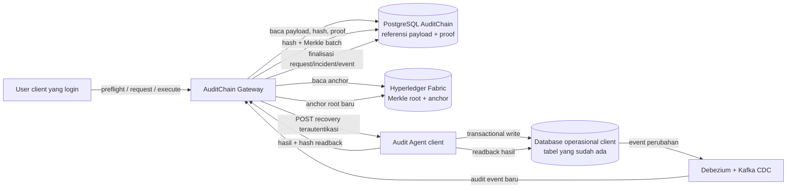
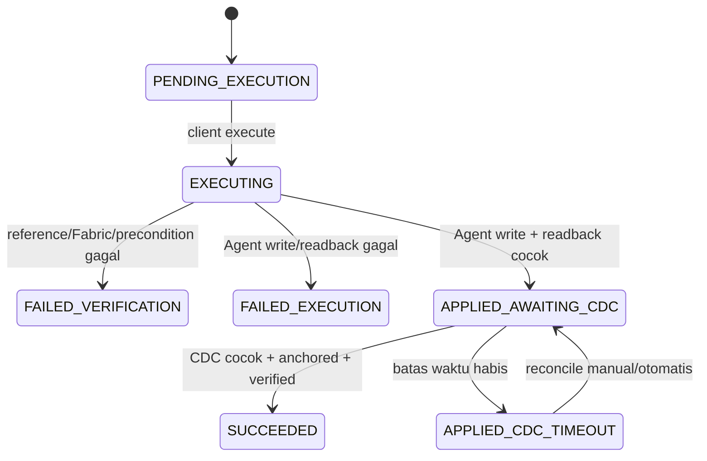

# Rencana Implementasi Recovery Langsung ke Database Client

## 1. Status Dokumen

- Tanggal penyusunan: 29 September 2026
- Repository: `auditchain-gateway-backend`
- Branch saat audit awal: `nama-fitur-baru`
- Status: implementation plan, belum merupakan bukti implementasi
- Target utama: mengubah recovery dari pemulihan `audit_logs` berbasis snapshot MinIO menjadi pemulihan state pada database operasional client melalui Audit Agent
- Prinsip kerja: dikerjakan berurutan per fase; fase berikutnya tidak boleh dimulai sebelum gate fase sebelumnya lulus

## 2. Keputusan Arsitektur yang Dikunci

Implementasi wajib mengikuti keputusan berikut.

1. Hyperledger Fabric adalah sumber bukti integritas kriptografis.
2. PostgreSQL AuditChain menyimpan payload referensi yang akan dipulihkan.
3. Database client adalah target recovery, bukan sumber referensi recovery.
4. Backend AuditChain menjadi koordinator validasi dan orkestrasi.
5. Audit Agent menjadi satu-satunya komponen yang menulis ke database client.
6. Agent menulis langsung ke tabel operasional yang sudah ada. Tidak boleh membuat tabel baru di database client.
7. MinIO tidak digunakan lagi pada jalur recovery baru.
8. Recovery tetap self-service oleh user client yang sedang login dan hanya untuk `client_id` miliknya sendiri.
9. Platform admin tidak diperlukan untuk approval maupun execute.
10. `recovery_requests`, `tamper_incidents`, dan `recovery_events` tetap disimpan di PostgreSQL AuditChain.
11. `audit_logs` hanya berisi event operasional dari CDC client. Recovery tidak membuat `action=RECOVERY` baru di tabel tersebut.
12. Incident baru boleh ditutup setelah write Agent berhasil, readback cocok, dan event CDC hasil recovery sudah dikonfirmasi oleh pipeline AuditChain.

## 3. Fakta Teknis yang Tidak Boleh Disalahartikan

Fabric tidak menyimpan row client atau metadata lengkap. Fabric menyimpan Merkle root dan data anchor. Karena itu, Fabric tidak dapat mengembalikan payload yang hilang.

Flow pembuktiannya adalah:

```text
payload referensi dari PostgreSQL AuditChain
        |
        | hitung ulang audit leaf/hash
        v
hash tersimpan + Merkle proof dari PostgreSQL AuditChain
        |
        | rekonstruksi Merkle root
        v
Merkle root hasil rekonstruksi
        |
        | harus sama persis
        v
Merkle root pada anchor Hyperledger Fabric
```

Setelah rangkaian tersebut valid, payload referensi boleh dipakai untuk menulis database client melalui Agent.

Konsekuensinya:

- jika database client rusak atau berubah, tetapi payload referensi AuditChain masih utuh dan valid terhadap Fabric, recovery dapat dilakukan;
- jika payload PostgreSQL AuditChain sendiri rusak atau hilang, Fabric hanya dapat membuktikan adanya ketidaksesuaian dan tidak dapat merekonstruksi payload;
- pemulihan PostgreSQL AuditChain yang rusak memerlukan backup/PITR/WAL atau penyimpanan payload terpercaya lain dan berada di luar flow recovery client ini;
- Fabric membuktikan bahwa sebuah event pernah di-anchor dan tidak berubah, tetapi tidak membuktikan bahwa perubahan tersebut sah secara bisnis.

Jika perubahan tidak sah sudah tertangkap CDC lalu ikut di-anchor, event tersebut tetap valid secara kriptografis. User harus memilih versi historis terverifikasi sebelum perubahan tersebut sebagai referensi rollback. Sistem tidak boleh menganggap semua event yang sudah di-anchor otomatis benar secara bisnis.

## 4. Kondisi Implementasi Saat Ini

Hasil audit kode sebelum implementasi:

- `internal/modules/recovery/service.go` masih membaca, memeriksa, dan mendekripsi snapshot MinIO;
- `Execute` masih memulihkan baris `audit_logs` di PostgreSQL AuditChain, bukan row di database client;
- startup `RECOVERY_ENABLED=true` masih mensyaratkan MinIO, encryption key, snapshot builder, dan Fabric;
- kandidat recovery masih mensyaratkan `snapshot_status=VERIFIED` dan seluruh referensi object MinIO;
- `recovery_requests` dan `recovery_events` masih memiliki kolom snapshot sebagai kontrak utama;
- pipeline `recovery_events` masih menunggu snapshot event sebelum agregasi dan anchoring;
- backend hanya memiliki client Agent untuk operasi baca (`GET /verify/:table/:id` dan `GET /table/:table`);
- belum ada kontrak write recovery pada Agent;
- incident yang ada terutama merepresentasikan kerusakan log Gateway/Fabric, belum memisahkan mismatch state database client;
- recovery event sudah dipisahkan dari `audit_logs`, sehingga pemisahan tabel ini dipertahankan.

Rencana ini mengganti jalur recovery tersebut secara terkontrol dan tetap mempertahankan histori lama sebagai read-only compatibility data.

## 5. Target Arsitektur



Ringkasnya:

```text
PostgreSQL AuditChain + Fabric proof
                |
                v
       validasi ketat Backend
                |
                v
             Agent
                |
                v
tabel operasional DB client yang sudah ada
                |
                v
          readback Agent
                |
                v
       CDC -> hash -> Fabric
                |
                v
      request selesai dan incident ditutup
```

## 6. Scope

### 6.1 Termasuk dalam pekerjaan

- validasi referensi PostgreSQL AuditChain terhadap Fabric tanpa MinIO;
- deteksi dan pencatatan mismatch state database client;
- pemilihan kandidat referensi terverifikasi pada resource dan tenant yang sama;
- preflight yang membaca kondisi aktual client melalui Agent;
- kontrak write recovery pada Agent;
- operasi `UPSERT`, `DELETE`, dan `NOOP` pada tabel client yang sudah ada;
- optimistic concurrency/precondition agar perubahan baru tidak tertimpa;
- idempotensi request Gateway dan write Agent;
- readback setelah write;
- korelasi event CDC hasil recovery;
- pencatatan recovery pada `recovery_events`;
- anchoring bukti recovery tanpa snapshot MinIO;
- pemisahan status integrity, source mismatch, execution, CDC confirmation, dan Fabric confirmation;
- update API, Swagger, dokumentasi, pengujian, deployment, observability, dan runbook.

### 6.2 Di luar scope

- membuat tabel baru di database client;
- menjalankan SQL arbitrary yang dikirim user atau Gateway;
- memulihkan PostgreSQL AuditChain yang payload-nya sudah rusak/hilang;
- menentukan otomatis apakah event yang sah secara kriptografis sah secara bisnis;
- menghapus histori snapshot/MinIO lama pada deployment pertama;
- backfill seluruh log lama;
- mengubah chaincode Fabric untuk menyimpan payload mentah.

## 7. Terminologi Status

Status harus dipisahkan agar UI tidak kembali menyamakan koneksi Agent dengan integritas data.

| Dimensi | Contoh status | Makna |
|---|---|---|
| `integrity_status` | `VALID`, `TAMPERED`, `PENDING`, `UNREACHABLE` | Integritas log AuditChain, proof, dan Fabric |
| `source_status` | `MATCHED`, `MISMATCH`, `MISSING`, `UNEXPECTED_PRESENT`, `UNREACHABLE`, `NOT_COMPARABLE` | Kondisi row aktual di database client dibanding referensi |
| `request_status` | `PENDING_EXECUTION`, `EXECUTING`, `APPLIED_AWAITING_CDC`, `SUCCEEDED`, `FAILED_*` | State machine recovery |
| `cdc_status` | `PENDING`, `CONFIRMED`, `TIMEOUT`, `CONFLICT` | Apakah write Agent sudah terlihat sebagai event CDC yang benar |
| `recovery_event.integrity_status` | `NOT_CHECKED`, `VALID`, `TAMPERED`, `UNREACHABLE` | Integritas bukti recovery event sendiri |

`UNREACHABLE` tidak boleh diterjemahkan menjadi `TAMPERED`. Ia berarti pemeriksaan tertentu tidak dapat diselesaikan.

## 8. Aturan Pemilihan Referensi Recovery

Sebuah `audit_logs` hanya boleh menjadi referensi jika semua syarat berikut terpenuhi:

1. `client_id` sama dengan JWT user;
2. `resource` sama dengan resource incident;
3. action adalah event client, bukan event internal Gateway;
4. action termasuk `INSERT`, `UPDATE`, atau `DELETE`;
5. status audit adalah `ANCHORED`;
6. `hash_value`, `merkle_root`, dan `blockchain_tx_id` tersedia;
7. hasil hitung ulang `GenerateLogHash` sama dengan `hash_value` tersimpan;
8. Merkle proof ditemukan dan urutannya valid;
9. root hasil rekonstruksi sama dengan `audit_logs.merkle_root`;
10. root yang sama ditemukan pada anchor Fabric;
11. metadata dapat diparse dan sesuai kontrak resource;
12. log tidak berasal dari tenant lain;
13. untuk recovery otomatis, referensi adalah latest client event terverifikasi;
14. untuk rollback historis manual, kandidat harus dipilih eksplisit dan ditampilkan lengkap pada preview.

Recovery tidak boleh memakai fallback `audit_logs.merkle_root == Fabric root` jika proof gagal. Fallback data legacy masih boleh dipakai untuk tampilan verifikasi lama, tetapi tidak cukup kuat untuk melakukan write ke database client.

## 9. Matriks Operasi Recovery

| Action referensi | Kondisi target saat ini | Operasi Agent | Hasil yang diwajibkan |
|---|---|---|---|
| `INSERT`/`UPDATE` | row ada tetapi berbeda | `UPDATE` field yang diizinkan | row sama dengan desired state |
| `INSERT`/`UPDATE` | row tidak ada | `INSERT`/safe upsert | row dibuat dengan primary key yang sama |
| `INSERT`/`UPDATE` | row sudah sama | `NOOP` | `recovery_not_required` |
| `DELETE` | row masih ada | `DELETE` | row tidak ditemukan saat readback |
| `DELETE` | row sudah tidak ada | `NOOP` | `recovery_not_required` |

Agent tidak menerima nama tabel, nama kolom, predicate, atau SQL mentah tanpa validasi allowlist lokal.

## 10. Alur End-to-End yang Harus Diimplementasikan

### 10.1 Deteksi mismatch sumber

1. Backend memverifikasi latest client event terhadap hash lokal, Merkle proof, dan Fabric.
2. Jika bukti internal tidak valid, hentikan proses dan buat/pertahankan incident integrity Gateway. Database client tidak boleh ditulis.
3. Jika bukti internal valid, Backend membaca row terkini melalui Agent.
4. Backend membandingkan metadata referensi dan state client dengan canonicalization yang sama.
5. Mismatch harus diperiksa ulang setelah grace period CDC untuk menghindari false positive akibat keterlambatan pipeline.
6. Setelah mismatch konsisten, buat incident bertipe `CLIENT_STATE_MISMATCH`, `CLIENT_ROW_MISSING`, atau `CLIENT_ROW_UNEXPECTED_PRESENT`.
7. Incident menyimpan hash state terdeteksi dan ringkasan discrepancy; raw payload sensitif hanya disimpan bila dienkripsi menggunakan evidence key terpisah.

### 10.2 Kandidat

1. Query kandidat dibatasi oleh `client_id` dan exact `resource`.
2. Setiap kandidat divalidasi menggunakan aturan pada Bagian 8.
3. Default kandidat adalah latest client event yang lolos seluruh pemeriksaan.
4. Versi historis dapat ditampilkan untuk rollback manual, tetapi tidak boleh dipilih lintas resource atau lintas tenant.
5. Response kandidat tidak lagi memuat syarat MinIO sebagai dasar eligibility.

### 10.3 Preflight

Preflight bersifat read-only dan wajib melakukan pemeriksaan ulang, bukan memakai cache dari verifikasi sebelumnya.

Urutan:

1. autentikasi JWT dan ambil `client_id` dari token;
2. load incident tenant-scoped;
3. load kandidat referensi tenant/resource-scoped;
4. hitung ulang audit leaf;
5. rekonstruksi Merkle root dari proof;
6. query exact anchor ke Fabric;
7. pastikan ketiga root sama;
8. parse target table dan record ID dari `resource` atau mapping terkonfigurasi;
9. panggil Agent read endpoint;
10. canonicalize response Agent;
11. tentukan `UPSERT`, `DELETE`, atau `NOOP`;
12. bekukan `reference_log_hash`, `reference_merkle_root`, `reference_anchor_id`, `desired_state_hash`, dan `client_before_hash` di response.

Preflight gagal tertutup (`fail closed`) jika Fabric atau Agent tidak dapat dijangkau. Preflight tidak boleh melakukan write.

### 10.4 Pembuatan request

1. User client mengirim incident, selected reference, reason, dan idempotency key.
2. Backend mengulang validasi referensi dan preflight.
3. Backend memastikan belum ada recovery aktif untuk resource yang sama.
4. Backend menyimpan immutable recovery intent di `recovery_requests`.
5. Status awal adalah `PENDING_EXECUTION`.
6. Tidak ada approval admin.
7. Pemanggilan ulang dengan `client_id + idempotency_key` yang sama mengembalikan request yang sama.
8. Idempotency key sama dengan payload berbeda menghasilkan `409 idempotency_conflict`.

### 10.5 Execute

1. Lock `recovery_requests` menggunakan `SELECT ... FOR UPDATE`.
2. Pastikan status masih executable dan tenant cocok.
3. Ubah status menjadi `EXECUTING`.
4. Validasi ulang referensi PostgreSQL AuditChain terhadap Fabric secara penuh.
5. Baca ulang state client melalui Agent.
6. Bandingkan `client_before_hash` dengan precondition yang dibekukan.
7. Jika state berubah setelah request dibuat, hentikan dengan `409 source_state_changed`; jangan menimpa perubahan baru.
8. Kirim command recovery ke Agent menggunakan recovery token khusus.
9. Agent menjalankan transaksi database.
10. Agent melakukan readback dalam/tepat setelah transaksi.
11. Gateway memvalidasi response dan readback hash.
12. Jika readback cocok, set request menjadi `APPLIED_AWAITING_CDC` dan buat/update `recovery_events`.
13. Jangan menutup incident pada tahap ini.

### 10.6 Konfirmasi CDC dan finalisasi

1. Debezium menangkap write Agent dari tabel client.
2. Event masuk melalui Kafka dan diproses oleh pipeline normal.
3. Reconciler mencocokkan event dengan recovery menggunakan:
   - `client_id`;
   - resource;
   - operation;
   - canonical `desired_state_hash`;
   - bounded time window;
   - hanya satu recovery aktif per resource.
4. `recovery_events.result_audit_log_id` diisi dengan log CDC yang cocok.
5. Event CDC melewati hashing, Merkle aggregation, dan anchoring Fabric normal.
6. Setelah log hasil recovery berstatus `ANCHORED` dan verifikasi Fabric valid:
   - request menjadi `SUCCEEDED`;
   - incident menjadi `RESOLVED`;
   - recovery event menjadi final;
   - UI menampilkan `RECOVERED`.
7. Jika CDC tidak muncul sampai timeout, status menjadi `APPLIED_CDC_TIMEOUT`. Sistem tidak boleh otomatis menulis ulang tanpa mengecek idempotency Agent.

## 11. State Machine Request



Aturan penting:

- status `SUCCEEDED` tidak boleh diberikan hanya karena HTTP Agent mengembalikan `200`;
- retry execute pada request yang sudah `APPLIED_AWAITING_CDC` tidak boleh mengulang write; hanya menjalankan readback/reconciliation;
- request `SUCCEEDED` harus idempoten dan mengembalikan hasil lama;
- request gagal verifikasi boleh dibuat ulang setelah masalah diperbaiki dengan idempotency key baru;
- satu resource hanya boleh memiliki satu request aktif.

## 12. Kontrak API Gateway yang Ditargetkan

Prefix tetap `/api/dashboard/recovery` dan menggunakan JWT client.

### 12.1 Endpoint read

```text
GET  /incidents
GET  /incidents/:incident_id
GET  /incidents/:incident_id/candidates
POST /incidents/:incident_id/preflight
GET  /resources/:resource/versions
GET  /requests
GET  /requests/:request_id
GET  /events
GET  /events/:event_id
GET  /events/:event_id/verify
```

### 12.2 Endpoint mutation

```text
POST /requests
POST /requests/:request_id/execute
```

Tidak ada endpoint approve/reject pada route aktif.

### 12.3 Request create

```json
{
  "incident_id": "incident-uuid",
  "selected_log_id": "trusted-reference-log-id",
  "reason": "Memulihkan row client ke state terverifikasi",
  "idempotency_key": "client-generated-unique-key"
}
```

### 12.4 Response preflight minimum

```json
{
  "status": "VALID",
  "recoverable": true,
  "operation": "UPSERT",
  "resource": "RUANGAN:81",
  "reference_log_id": "...",
  "reference_log_hash": "...",
  "reference_merkle_root": "...",
  "reference_anchor_id": "...",
  "desired_state_hash": "...",
  "client_before_hash": "...",
  "source_status": "MISMATCH",
  "reference_preview": {},
  "client_preview": {},
  "discrepancies": []
}
```

Payload preview harus melalui redaction policy untuk password, token, secret, dan field sensitif lain.

## 13. Kontrak Agent Recovery

Implementasi Agent berada di sisi client. Jika source code Agent tidak berada di repository ini, perubahan Agent menjadi dependency eksternal dan merupakan gate sebelum E2E dapat dinyatakan selesai.

### 13.1 Endpoint

```text
POST /recover/:table/:record_id
Authorization: Bearer <AGENT_RECOVERY_TOKEN>
Content-Type: application/json
```

Token write harus dipisahkan dari token read `AGENT_VERIFY_TOKEN` agar prinsip least privilege terpenuhi.

### 13.2 Request

```json
{
  "request_id": "recovery-request-uuid",
  "idempotency_key": "gateway-stable-command-id",
  "operation": "UPSERT",
  "expected_before_hash": "sha3-256-canonical-current-state",
  "desired_state_hash": "sha3-256-canonical-desired-state",
  "desired_state": {},
  "reference": {
    "log_id": "...",
    "audit_leaf_hash": "...",
    "merkle_root": "...",
    "anchor_id": "..."
  },
  "issued_at": "2026-09-29T00:00:00Z"
}
```

### 13.3 Response berhasil

```json
{
  "request_id": "recovery-request-uuid",
  "operation": "UPSERT",
  "applied": true,
  "idempotent_replay": false,
  "before_hash": "...",
  "after_hash": "...",
  "readback_match": true,
  "found_after": true,
  "checked_at": "2026-09-29T00:00:01Z"
}
```

### 13.4 Error minimum

| HTTP | Code | Makna |
|---:|---|---|
| 400 | `invalid_payload` | payload atau operation tidak valid |
| 401 | `invalid_agent_token` | token write salah |
| 403 | `table_not_allowed` / `column_not_allowed` | scope write ditolak |
| 404 | `resource_mapping_not_found` | mapping tabel/PK tidak tersedia |
| 409 | `source_state_changed` | current state berbeda dari precondition |
| 409 | `idempotency_conflict` | key sama dengan command berbeda |
| 422 | `write_rejected` | constraint atau validasi DB menolak |
| 500 | `readback_mismatch` | hasil write tidak sesuai desired state |
| 503 | `database_unreachable` | DB client tidak tersedia |

### 13.5 Aturan implementasi Agent

- table allowlist berasal dari konfigurasi Agent lokal;
- mapping primary key ditentukan lokal, bukan dari SQL kiriman Gateway;
- kolom immutable/generated/credential harus diblokir;
- seluruh value memakai parameterized query;
- identifier divalidasi terhadap allowlist, tidak diinterpolasi bebas;
- write dan pembacaan state terkait dilakukan dalam transaksi yang sesuai engine DB;
- idempotency disimpan tanpa membuat tabel client baru, misalnya cache/file durable Agent atau store internal Agent di luar database operasional;
- response tidak mengembalikan secret field;
- log Agent mencatat request ID dan hasil, bukan token atau seluruh payload sensitif;
- timeout, ukuran payload, dan jumlah kolom dibatasi;
- Agent menolak command kedaluwarsa berdasarkan `issued_at` dan clock-skew yang ditentukan.

## 14. Canonicalization dan Hash State

Audit leaf dan client state hash adalah dua hal berbeda.

### 14.1 Audit leaf

Tetap memakai `hasher.GenerateLogHash` atas field audit yang berlaku. Hash ini digunakan untuk Merkle proof dan Fabric.

### 14.2 Desired/client state hash

Tambahkan fungsi bersama untuk:

```text
SHA3-256(schema_version | client_id | normalized_resource | canonical_json(state))
```

Aturan canonical state:

- key dinormalisasi ke lowercase dan trim;
- key duplikat setelah normalisasi ditolak;
- object diurutkan deterministik;
- number dinormalisasi tanpa mengubah makna;
- timestamp dinormalisasi ke UTC dengan aturan presisi terdokumentasi;
- `null` dibedakan dari missing;
- field yang diabaikan harus berasal dari policy eksplisit per table;
- zero compared fields menghasilkan `NOT_COMPARABLE`, bukan `MATCHED`.

Logic canonicalization harus menjadi package reusable dengan test vector yang dipakai Gateway dan Agent.

## 15. Perubahan Model PostgreSQL AuditChain

Semua perubahan berikut berada di database AuditChain, bukan database client.

### 15.1 `tamper_incidents`

Tambahkan secara additive:

| Kolom | Tujuan |
|---|---|
| `incident_scope` | `GATEWAY_INTEGRITY` atau `CLIENT_SOURCE` |
| `source_status` | jenis mismatch aktual |
| `reference_log_id` | log acuan yang valid |
| `detected_state_hash` | hash state client saat deteksi |
| `discrepancy_summary` JSONB | detail redacted untuk UI/forensik |
| `last_confirmed_at` | waktu mismatch terakhir dikonfirmasi |

Index aktif tetap tenant-scoped. Tambahkan pembatas agar satu incident source aktif per `client_id + resource + incident_type`.

### 15.2 `recovery_requests`

Tambahkan:

| Kolom | Tujuan |
|---|---|
| `resource` | target exact resource |
| `operation` | `UPSERT`/`DELETE` |
| `reference_log_hash` | leaf hash referensi yang dibekukan |
| `reference_merkle_root` | root referensi |
| `reference_anchor_id` | anchor Fabric |
| `desired_state_hash` | hash canonical state tujuan |
| `client_before_hash` | optimistic concurrency precondition |
| `agent_command_id` | idempotency command ke Agent |
| `agent_applied_at` | waktu write/readback sukses |
| `cdc_status` | status korelasi CDC |
| `cdc_deadline_at` | batas tunggu |
| `result_audit_log_id` | event CDC hasil recovery |

Kolom snapshot lama dibuat nullable dan ditandai legacy. Jangan drop pada deployment pertama.

### 15.3 `recovery_events`

Tambahkan:

| Kolom | Tujuan |
|---|---|
| `operation` | operasi ke DB client |
| `reference_log_hash` | audit leaf sumber |
| `reference_merkle_root` | root sumber |
| `reference_anchor_id` | anchor sumber |
| `client_before_hash` | state sebelum write |
| `client_after_hash` | state hasil readback |
| `readback_status` | hasil verifikasi Agent |
| `result_audit_log_id` | log CDC hasil write |
| `cdc_status` | status konfirmasi |

Kolom source snapshot lama dipertahankan untuk histori legacy tetapi tidak diisi pada recovery baru.

### 15.4 Constraint/index

- unique `client_id + idempotency_key` tetap dipertahankan;
- unique `request_id` pada recovery event tetap dipertahankan;
- partial unique index satu request aktif per `client_id + resource`;
- foreign/reference checks dilakukan tenant-scoped;
- perubahan nullability snapshot memakai SQL migration idempoten karena AutoMigrate saja tidak cukup;
- migration harus aman dijalankan ulang.

## 16. Perubahan Kode per Komponen

### 16.1 `internal/modules/recovery`

- pisahkan repository, trusted-reference validator, Agent recovery client, dan orchestration service;
- ganti `validateSnapshot` menjadi `validateTrustedReference`;
- ganti `executeSnapshot` menjadi `executeClientRecovery`;
- ubah candidates/preflight/create/execute agar tidak bergantung MinIO;
- tambahkan state `APPLIED_AWAITING_CDC` dan failure code yang terstruktur;
- incident baru ditutup oleh finalizer setelah CDC/Fabric confirmation;
- failed event tidak boleh menyimpan secret/raw token.

Struktur yang disarankan:

```text
internal/modules/recovery/
  repository.go
  reference_validator.go
  agent_client.go
  canonical_state.go
  service.go
  reconciler.go
  handler.go
  router.go
  *_test.go
```

### 16.2 `internal/blockchain/agentverifier`

- ekspor client read yang terstruktur agar dapat dipakai preflight recovery;
- perbaiki canonical key/value comparison sebelum dijadikan security gate;
- missing field harus discrepancy;
- zero comparable fields harus ditolak;
- klasifikasikan timeout, 401, 404, malformed response, dan connection error;
- jangan memakai `VerifyToken` untuk write recovery.

### 16.3 `internal/engine/kafkaconsumer`

- setelah audit event baru tersimpan, panggil correlator recovery;
- korelasi berdasarkan tenant/resource/action/state hash/time window;
- isi `result_audit_log_id` tanpa mengubah fakta bahwa event tersebut berasal dari CDC client;
- jangan membuat action `RECOVERY` di `audit_logs`;
- cegah satu event diklaim oleh dua request.

### 16.4 `internal/engine/aggregator` dan Fabric service

- audit event client tetap memakai pipeline normal;
- recovery event boleh diagregasi langsung dari `HASHED` tanpa syarat snapshot MinIO;
- hash recovery event harus mencakup reference proof, operation, before/after hash, Agent result, dan CDC result yang immutable;
- status final recovery event diverifikasi melalui Merkle proof + Fabric;
- jangan mencampur recovery event ke Merkle batch `audit_logs`.

### 16.5 `internal/config/database.go`

- tambah field/model migration additive;
- buat helper idempotent untuk nullability snapshot legacy dan partial indexes;
- jangan mengubah atau menghapus baris historis lama;
- migration failure harus menggagalkan startup sebelum worker aktif.

### 16.6 `main.go`

- hilangkan requirement `RECOVERY_ENABLED -> SNAPSHOT_REQUIRED_FOR_ANCHOR`;
- recovery baru mensyaratkan database, Fabric, Agent configuration, dan evidence cipher bila raw evidence disimpan;
- wiring recovery tidak menerima MinIO store/cipher/snapshot builder;
- start recovery reconciler dengan interval dan timeout terkonfigurasi;
- pada fase transisi, snapshot worker lama hanya boleh hidup bila mode legacy eksplisit diaktifkan.

### 16.7 Konfigurasi

Tambahkan contoh:

```text
RECOVERY_MODE=agent_direct
RECOVERY_ENABLED=true
RECOVERY_CDC_TIMEOUT_SECONDS=120
RECOVERY_RECONCILE_INTERVAL_SECONDS=5
RECOVERY_AGENT_TIMEOUT_SECONDS=15
RECOVERY_EVIDENCE_ENCRYPTION_KEY=...
```

Deprecate untuk flow baru:

```text
SNAPSHOT_WRITER_ENABLED
SNAPSHOT_REQUIRED_FOR_ANCHOR
RECOVERY_CUTOFF_AT
MINIO_*
SNAPSHOT_*
```

Rahasia Agent recovery tidak boleh tampil dalam response API, log, Swagger example nyata, atau Git.

## 17. Strategi Melepas MinIO

MinIO tidak dihapus secara destruktif pada fase pertama.

### Tahap A — decouple

- recovery baru tidak membaca atau menulis MinIO;
- anchoring audit baru tidak menunggu snapshot;
- recovery event baru tidak menunggu snapshot;
- object dan kolom lama tetap read-only;
- endpoint legacy dapat diberi label `legacy` untuk masa transisi.

### Tahap B — observasi

- jalankan staging minimal satu siklus penuh;
- pastikan tidak ada request baru ke MinIO dari recovery path;
- pastikan worker snapshot tidak diperlukan untuk readiness;
- pastikan recovery event baru dapat di-anchor tanpa snapshot.

### Tahap C — cleanup terpisah

- hapus service MinIO dari Compose hanya setelah observasi dan approval eksplisit;
- jangan menghapus bucket/object historis secara otomatis;
- hapus kode snapshot lama melalui PR terpisah setelah rollback window berakhir;
- dokumentasikan cara membaca evidence legacy sebelum kode compatibility dihapus.

## 18. Kontrol Keamanan Wajib

1. Tenant diambil dari JWT, bukan query/body.
2. Admin platform ditolak untuk execute jika kebijakan self-service client dipertahankan.
3. Gateway memvalidasi referensi terhadap Fabric sebelum setiap write.
4. Agent menggunakan recovery token terpisah dengan rotasi.
5. Agent URL hanya boleh menuju endpoint terdaftar; validasi SSRF dan private-network policy harus diterapkan.
6. TLS/mTLS digunakan pada lingkungan produksi; bearer token tanpa TLS tidak cukup.
7. Table dan column allowlist berada di Agent.
8. Tidak ada arbitrary SQL.
9. Optimistic concurrency mencegah overwrite perubahan baru.
10. Request dan Agent command idempoten.
11. One-active-recovery-per-resource mencegah race.
12. Preview dan log menerapkan redaction field sensitif.
13. Ukuran payload, timeout, dan retry dibatasi.
14. Fabric unreachable menyebabkan fail closed.
15. Readback mismatch menyebabkan gagal, bukan sukses parsial tersembunyi.
16. Secret tidak disimpan pada `recovery_events`.
17. Semua kegagalan mempunyai stable error code, bukan hanya string bebas.

## 19. Failure Matrix yang Wajib Diuji

| Skenario | Hasil yang diharapkan |
|---|---|
| JWT tenant A mencoba incident tenant B | `404`/`403`, tidak ada kebocoran data |
| referensi PostgreSQL dimanipulasi | `FAILED_VERIFICATION`, Agent tidak dipanggil |
| audit leaf tidak sama dengan `hash_value` | gagal tertutup |
| Merkle proof hilang/salah | gagal tertutup, tanpa legacy fallback |
| root DB berbeda dengan Fabric | gagal tertutup |
| Fabric tidak tersedia | `UNREACHABLE`/`FAILED_VERIFICATION`, tidak ada write |
| Agent read tidak tersedia | preflight gagal, tidak ada write |
| Agent token read salah | error terklasifikasi |
| Agent recovery token salah | `FAILED_EXECUTION`, tidak ada perubahan |
| table tidak di-allowlist | Agent `403`, tidak ada perubahan |
| column terlarang ada di payload | Agent `403`, tidak ada perubahan |
| state berubah sesudah preflight | `409 source_state_changed` |
| execute dikirim dua kali | satu write, replay idempoten |
| request ID sama dengan payload berbeda | `409 idempotency_conflict` |
| write DB constraint gagal | rollback transaction |
| write sukses tetapi readback berbeda | gagal dan incident tetap terbuka |
| write/readback sukses, CDC terlambat | `APPLIED_AWAITING_CDC` lalu timeout terukur |
| CDC datang dua kali | satu korelasi/finalisasi |
| event CDC sesuai tetapi belum anchored | request belum `SUCCEEDED` |
| event CDC anchored dan valid | request `SUCCEEDED`, incident `RESOLVED` |
| action DELETE dan row sudah hilang | `recovery_not_required` |
| historical rollback dipilih | hanya same tenant/resource dan proof valid |
| zero comparable fields | `NOT_COMPARABLE`, bukan `MATCHED` |
| key Agent uppercase, metadata lowercase | dibandingkan setelah normalization |
| legacy request snapshot lama | tetap dapat dibaca, tidak dieksekusi oleh flow baru tanpa aturan compatibility |

## 20. Strategi Pengujian

### 20.1 Unit test

- canonical JSON/state hash;
- case/type/timestamp normalization;
- reference validator;
- Merkle proof strict validation;
- operation resolver;
- state machine;
- idempotency conflict;
- Agent error classification;
- recovery event hash;
- CDC correlator;
- redaction policy.

### 20.2 Integration test PostgreSQL

- migration dari schema lama ke schema baru;
- partial unique index request aktif;
- tenant isolation;
- transaction/row locking;
- request state transition;
- incident hanya ditutup setelah final confirmation;
- duplicate CDC tidak menggandakan recovery event.

### 20.3 Contract test Agent

- test vector canonicalization yang sama di Gateway dan Agent;
- UPSERT existing row;
- UPSERT missing row;
- DELETE existing row;
- DELETE missing row;
- precondition conflict;
- idempotent replay;
- table/column rejection;
- readback mismatch;
- token/TLS behavior.

### 20.4 E2E staging

1. buat data client baru;
2. tunggu audit event anchored;
3. ubah row client secara terkontrol;
4. verifikasi mismatch dan incident;
5. buka candidates dan preflight;
6. create request sebagai user client;
7. execute tanpa admin;
8. pastikan Agent menulis tabel existing;
9. pastikan readback cocok;
10. pastikan status `APPLIED_AWAITING_CDC` muncul;
11. tunggu event CDC baru;
12. tunggu event tersebut anchored;
13. pastikan request `SUCCEEDED` dan incident `RESOLVED`;
14. pastikan `recovery_events` berisi bukti operasi;
15. pastikan `audit_logs` tidak berisi event sintetis `RECOVERY` baru;
16. ulangi untuk INSERT/UPDATE/DELETE dan failure matrix utama.

### 20.5 Quality gate lokal

```text
gofmt -l .
go mod verify
go vet -p 1 ./...
go test -p 1 ./... -count=1 -timeout=120s
go build -p 1 ./...
git diff --check
```

Swagger harus diregenerasi dan diff harus direview. Docker/Compose config dan script shell juga harus divalidasi bila berubah.

## 21. Observability

Tambahkan log terstruktur dan metrics berikut tanpa payload sensitif:

- `recovery_preflight_total{result}`;
- `recovery_reference_validation_total{result}`;
- `recovery_agent_write_total{operation,result}`;
- `recovery_agent_readback_total{result}`;
- `recovery_cdc_confirmation_seconds`;
- `recovery_cdc_timeout_total`;
- `recovery_finalization_total{result}`;
- `recovery_active_requests`;
- `recovery_source_mismatch_total{type}`.

Setiap log mencantumkan `request_id`, `incident_id`, `client_id`, dan resource yang sudah disanitasi. Token dan full payload tidak boleh dicatat.

Alert minimum:

- banyak `source_state_changed` pada satu resource;
- Agent write failure meningkat;
- request lama tertahan di `EXECUTING` atau `APPLIED_AWAITING_CDC`;
- CDC confirmation timeout;
- Fabric reference validation gagal;
- migration/startup gagal.

## 22. Urutan Implementasi dan Gate

### Fase 0 — baseline dan kontrak final

Pekerjaan:

- bekukan diagram dan keputusan pada dokumen ini;
- identifikasi repository/source Agent;
- inventaris engine DB client dan tabel yang akan didukung pertama;
- simpan baseline test dan schema;
- tentukan redaction serta table/column allowlist awal.

Gate 0:

- kontrak Agent disetujui;
- repo Agent dapat dibangun dan diuji;
- tabel pilot dan primary key mapping diketahui;
- tidak ada perubahan kode recovery sebelum gate ini lulus.

### Fase 1 — canonical state dan trusted reference validator

Pekerjaan:

- buat canonical state package;
- buat validator audit leaf + proof + Fabric;
- tambahkan unit test strict/no fallback;
- gunakan validator pada preflight read-only internal terlebih dahulu.

Gate 1:

- tamper pada payload/hash/proof/root selalu ditolak;
- reference valid selalu menghasilkan root Fabric yang sama;
- test vector deterministik lulus.

### Fase 2 — schema AuditChain dan compatibility

Pekerjaan:

- tambah field model;
- migration additive dan idempotent;
- buat snapshot field legacy nullable;
- tambah indexes dan state baru;
- pertahankan pembacaan histori lama.

Gate 2:

- migration berhasil pada database kosong dan salinan schema lama;
- rollback aplikasi masih dapat membaca data lama;
- tidak ada data historis yang dihapus.

### Fase 3 — Agent write contract

Pekerjaan:

- endpoint recovery Agent;
- recovery token terpisah;
- allowlist/mapping;
- transaction, precondition, idempotency, dan readback;
- contract tests untuk engine pilot.

Gate 3:

- Agent tidak dapat menulis tabel/kolom di luar allowlist;
- retry tidak menggandakan perubahan;
- race menghasilkan `409`, bukan overwrite;
- readback mismatch gagal tertutup.

### Fase 4 — Gateway preflight dan request baru

Pekerjaan:

- candidates tanpa MinIO;
- preflight dengan Fabric + Agent read;
- request immutable intent;
- idempotency conflict;
- tenant isolation;
- Swagger/API docs.

Gate 4:

- tidak ada write pada preflight/create;
- cross-tenant dan cross-resource ditolak;
- kandidat invalid tidak dapat menjadi request.

### Fase 5 — Gateway execute ke Agent

Pekerjaan:

- Agent recovery client;
- request lock/state machine;
- revalidation dan precondition;
- execute + readback;
- `APPLIED_AWAITING_CDC`;
- failure event terstruktur.

Gate 5:

- Agent tidak pernah dipanggil sebelum Fabric validation lulus;
- success HTTP tanpa readback tidak dianggap berhasil;
- retry execute aman.

### Fase 6 — CDC correlation dan finalizer

Pekerjaan:

- correlator pada ingestion/reconciler;
- link `result_audit_log_id`;
- tunggu anchoring;
- finalisasi request/incident/event;
- timeout dan recovery stuck reconciliation.

Gate 6:

- request hanya `SUCCEEDED` setelah event CDC terverifikasi;
- duplicate/out-of-order CDC tidak menyebabkan finalisasi ganda;
- incident tetap terbuka pada timeout.

### Fase 7 — recovery event tanpa MinIO

Pekerjaan:

- hash recovery event baru;
- agregasi tanpa snapshot gate;
- anchor Fabric;
- verify event melalui hash/proof/Fabric;
- legacy compatibility.

Gate 7:

- recovery event baru dapat diverifikasi tanpa MinIO;
- recovery event tidak masuk ke `audit_logs`;
- event legacy tetap dapat dibaca.

### Fase 8 — decouple runtime MinIO

Pekerjaan:

- ubah startup validation/wiring;
- nonaktifkan snapshot gate pada flow baru;
- update environment example, Compose, scripts, dan runbook;
- pertahankan legacy mode selama rollback window.

Gate 8:

- Gateway recovery mode dapat start tanpa MinIO;
- health/readiness tidak bergantung MinIO;
- audit ingestion dan Fabric anchoring tetap berjalan.

### Fase 9 — hardening dan failure tests

Pekerjaan:

- jalankan seluruh failure matrix;
- security review endpoint write;
- concurrency/load test terbatas;
- perbaiki observability dan operator runbook.

Gate 9:

- semua skenario kritis memiliki bukti test;
- tidak ada secret pada log/diff;
- tidak ada arbitrary SQL path;
- quality gate lokal lulus.

### Fase 10 — staging E2E dan rollout

Pekerjaan:

- deploy Gateway dan Agent kompatibel;
- jalankan E2E terkontrol untuk INSERT/UPDATE/DELETE;
- pantau CDC/Fabric finalization;
- lakukan failure drill Agent/Fabric/CDC;
- dokumentasikan bukti hasil.

Gate 10:

- acceptance criteria lulus;
- rollback telah diuji;
- production baru boleh dijadwalkan setelah sign-off.

## 23. Timeline Estimasi

Estimasi berikut memakai hari kerja dan mengasumsikan source code Agent tersedia serta satu engine database client dijadikan pilot.

| Hari | Fase | Output utama |
|---:|---|---|
| 1 | Fase 0 | kontrak final, mapping tabel/PK, baseline |
| 2-3 | Fase 1 | canonical state + strict trusted-reference validator |
| 4 | Fase 2 | migration/model compatibility |
| 5-6 | Fase 3 | endpoint write Agent + contract tests |
| 7-8 | Fase 4 | candidates, preflight, create request baru |
| 9-10 | Fase 5 | execute ke Agent, readback, idempotency |
| 11-12 | Fase 6 | CDC correlator + finalizer |
| 13 | Fase 7 | recovery event proof tanpa MinIO |
| 14 | Fase 8 | runtime/config MinIO decoupling |
| 15-16 | Fase 9 | failure matrix, security, regression |
| 17 | Fase 10 | deploy staging dan E2E |
| 18 | Fase 10 | failure drill, observasi, rollback test |
| 19-20 | Buffer | perbaikan temuan dan sign-off |

Total realistis: **18 hari kerja + buffer 2 hari**, sekitar **4 minggu kalender**.

Timeline bertambah jika:

- Agent berada di repository berbeda dan belum mempunyai framework write;
- lebih dari satu engine database harus didukung sekaligus;
- CDC tidak menyediakan data cukup untuk korelasi deterministik;
- mTLS/certificate distribution belum tersedia;
- schema client tidak mempunyai primary key atau mapping yang stabil.

## 24. Strategi Rollout

### 24.1 Feature flag

Gunakan mode eksplisit:

```text
RECOVERY_MODE=snapshot_legacy | agent_direct
```

Urutan rollout:

1. deploy schema/model yang backward compatible;
2. deploy Agent yang sudah mempunyai endpoint recovery tetapi belum diaktifkan;
3. deploy Gateway dengan `RECOVERY_ENABLED=false` atau `RECOVERY_MODE=snapshot_legacy`;
4. smoke test read verification;
5. aktifkan `agent_direct` hanya untuk client pilot;
6. jalankan E2E staging/pilot;
7. perluas per client setelah bukti berhasil;
8. hentikan legacy snapshot path setelah rollback window.

### 24.2 Rollback

- matikan `agent_direct` melalui feature flag;
- jangan rollback migration additive;
- request `APPLIED_AWAITING_CDC` tetap direkonsiliasi, bukan dieksekusi ulang;
- pertahankan Agent endpoint compatible selama request aktif masih ada;
- jangan menghapus recovery event atau histori lama;
- jika write Agent sudah terjadi, rollback aplikasi tidak boleh mencoba membalikkan row secara otomatis.

## 25. Acceptance Criteria

Implementasi dinyatakan selesai hanya jika seluruh poin berikut terbukti:

- user client dapat melakukan recovery tanpa admin;
- tenant isolation terbukti;
- referensi PostgreSQL AuditChain diverifikasi ketat terhadap Fabric;
- MinIO tidak dipanggil pada flow recovery baru;
- Agent menulis tabel existing tanpa membuat tabel baru;
- Agent tidak menerima arbitrary SQL;
- UPSERT dan DELETE mempunyai precondition serta readback;
- duplicate execute menghasilkan satu perubahan;
- request tidak `SUCCEEDED` sebelum CDC dan Fabric confirmation;
- incident tidak `RESOLVED` sebelum final confirmation;
- recovery evidence tersimpan pada `recovery_events`, bukan sebagai `audit_logs.action=RECOVERY`;
- event CDC hasil write tetap tercatat sebagai event client normal;
- recovery event baru dapat diverifikasi tanpa snapshot MinIO;
- gateway dapat start dan menjalankan recovery tanpa MinIO;
- seluruh unit, integration, contract, E2E, failure, vet, build, dan diff checks lulus;
- rollback procedure diuji;
- dokumentasi API, deployment, dan operator runbook diperbarui.

## 26. Status Implementasi Gateway (2026-09-29)

Bagian ini mencatat kemajuan kode pada repository Gateway. Status ini bukan
bukti deployment server atau bukti E2E staging; kedua hal tersebut tetap harus
diverifikasi setelah Agent dan konfigurasi runtime pilot tersedia.

### Selesai di repository ini

- Fase 1: canonical JSON/state dan strict trusted-reference validator dengan
  pemeriksaan leaf, proof, root, dan anchor Fabric.
- Fase 2: model serta migration additive untuk scope incident, desired state,
  precondition, Agent command, CDC, dan recovery event; field snapshot lama
  dibuat nullable untuk compatibility.
- Fase 4: candidates, preflight, create request direct, idempotency conflict,
  tenant isolation, dan client-only execution route.
- Fase 5: client Agent read/write contract pada Gateway, recovery token
  terpisah, state lock, precondition, readback, dan failure event.
- Fase 6: korelasi CDC, status `APPLIED_AWAITING_CDC`, timeout, finalizer,
  serta penutupan incident hanya setelah event recovery terverifikasi.
- Fase 7: recovery event direct tidak ditulis ke `audit_logs`, dapat masuk ke
  Merkle/Fabric tanpa snapshot MinIO, dan mempunyai verifikasi proof sendiri.
- Fase 8: `RECOVERY_MODE=agent_direct` tidak mensyaratkan MinIO untuk jalur
  recovery baru; mode `snapshot_legacy` tetap dipertahankan untuk rollback.
- Fase 9 (bagian yang dapat diverifikasi di Gateway): redaction rekursif untuk
  preview dan evidence, field `DesiredState` tidak diserialisasikan ke API,
  dan metadata recovery event disimpan dalam bentuk ter-redact.
- Automated Gateway tests, `go vet`, `go build`, dan `git diff --check` lulus
  pada workspace saat dokumen ini diperbarui.

Guard tambahan yang sudah diterapkan pada jalur direct:

- incident harus berscope `CLIENT_SOURCE`; incident `GATEWAY_INTEGRITY` tidak
  dapat dijadikan izin menulis database client;
- referensi memakai `reference_log_id` bila tersedia dan resource incident
  harus sama persis dengan resource audit log;
- latest client event dipilih dengan `COALESCE(db_timestamp, timestamp)` agar
  urutan CDC tidak tertukar oleh timestamp sumber yang kosong/berbeda;
- korelasi CDC dibatasi dari `agent_applied_at` sampai deadline dan tidak dapat
  mengklaim log referensi lama;
- kegagalan reference/Fabric/precondition disimpan sebagai
  `FAILED_VERIFICATION`, sedangkan write/readback Agent sebagai
  `FAILED_EXECUTION`;
- `agent_direct` mematikan gate snapshot legacy secara eksplisit sehingga flag
  snapshot lama tidak memblokir startup atau anchoring audit baru.

Catatan keamanan: state canonical penuh tetap berada di memori/request internal
karena itulah payload yang harus dikirim ke Agent. API dan `recovery_events`
tidak mengembalikan atau menyimpan field sensitif dalam bentuk mentah. Jika
pilot mencakup kolom credential, penyimpanan `recovery_requests.desired_state`
harus ditambah enkripsi at-rest melalui secret manager sebelum production.

### Belum selesai dan menjadi gate berikutnya

- Fase 3 belum dapat dinyatakan selesai end-to-end karena implementasi server
  Agent berada di luar repository ini. Agent harus menyediakan endpoint
  `POST /recover/:table/:record_id`, recovery token terpisah, allowlist kolom,
  transaksi, idempotency, precondition, dan readback sesuai kontrak bagian 12.
- Migration additive belum dijalankan pada database staging/production dari
  sesi ini; jalankan startup Gateway pada salinan schema lama dan periksa
  index/data conflict sebelum pilot.
- Fase 9-10: failure matrix, deploy staging, E2E INSERT/UPDATE/DELETE,
  Agent/Fabric/CDC failure drill, dan rollback test belum memiliki bukti live.

Feature flag runtime yang benar adalah kombinasi:

```text
RECOVERY_ENABLED=false                 # disabled
RECOVERY_ENABLED=true
RECOVERY_MODE=snapshot_legacy          # rollback/legacy
RECOVERY_MODE=agent_direct             # jalur direct client DB
```

`RECOVERY_MODE=disabled` tidak dipakai sebagai nilai mode tersendiri pada
Gateway saat ini.

## 27. Definition of Done per Pull Request

Setiap PR harus kecil dan mengikuti urutan berikut:

1. PR canonicalization + strict reference validator;
2. PR schema/model additive;
3. PR Agent write contract;
4. PR Gateway preflight/request;
5. PR Gateway execute/readback;
6. PR CDC correlation/finalizer;
7. PR recovery event proof tanpa MinIO;
8. PR runtime MinIO decoupling;
9. PR docs/Swagger/runbook dan bukti staging.

Satu PR tidak boleh sekaligus mengubah schema, Agent write, state machine, CDC correlation, dan menghapus MinIO. Pemisahan ini diperlukan agar review, rollback, dan diagnosis tetap aman.

Checklist setiap PR:

- perubahan sesuai fase aktif;
- test baru mencakup happy path dan failure path;
- tidak ada perubahan unrelated;
- tidak ada secret;
- backward compatibility dinilai;
- observability ditambahkan bila ada state baru;
- dokumentasi kontrak diperbarui;
- gate fase terkait lulus.

## 28. Risiko Utama dan Mitigasi

| Risiko | Dampak | Mitigasi |
|---|---|---|
| PostgreSQL AuditChain rusak | payload referensi tidak dapat dipakai | fail closed; backup/PITR, bukan Fabric restore |
| event tidak sah sudah di-anchor | Fabric tetap menganggap immutable | user memilih referensi historis; policy/business approval terpisah |
| CDC lag | false mismatch atau finalization lambat | grace period, retry, state `AWAITING_CDC` |
| concurrent client update | data baru tertimpa | `expected_before_hash` + transaction/lock |
| execute retry | duplicate write | idempotency Gateway dan Agent |
| schema client berubah | write salah/gagal | Agent allowlist dan schema fingerprint |
| key normalization beda | false match/mismatch | shared test vectors dan zero-field rejection |
| Agent dibajak | write ke DB client | token terpisah, TLS/mTLS, allowlist, rotation |
| legacy proof tidak lengkap | referensi lemah | tidak eligible untuk direct recovery |
| recovery sudah applied tetapi CDC timeout | status ambigu | readback evidence, reconcile, jangan auto-rewrite |

## 29. Catatan Status Saat Ini

Implementasi Gateway sudah melewati gate kode lokal untuk canonicalization,
trusted reference, model additive, Agent client, state machine, CDC
reconciliation, recovery event terpisah, dan runtime direct mode. Status tersebut
tidak menggantikan bukti deployment atau E2E live.

Gate yang masih wajib dipenuhi sebelum `RECOVERY_MODE=agent_direct` dipakai di
production:

- implementasi endpoint write Agent berada di repository/service eksternal;
- migration additive harus dijalankan dan diperiksa pada staging;
- contract test Gateway-Agent harus memakai vector canonicalization yang sama;
- E2E INSERT/UPDATE/DELETE dan failure matrix Agent/Fabric/CDC harus direkam;
- Swagger generated artifacts harus diregenerasi saat tool/dependency tersedia;
- rollback dan observability harus diuji pada deployment pilot.

Tidak ada fase yang boleh dinyatakan selesai hanya karena kode berhasil di-
compile. Setiap fase selesai setelah gate dan bukti pengujiannya tersedia.
