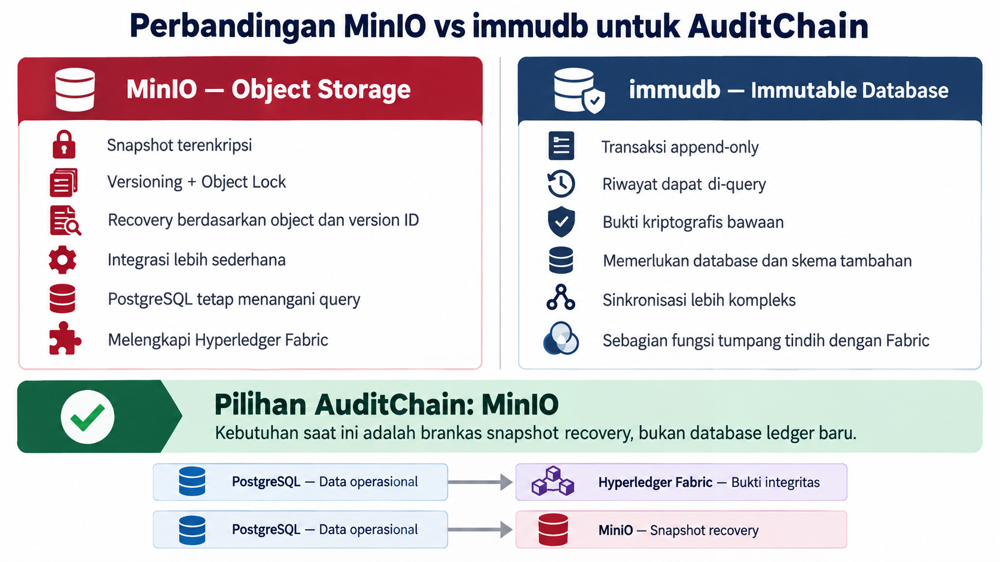

# Perbandingan MinIO dan Immutable Database untuk AuditChain

## 1. Tujuan dokumen

Dokumen ini menjelaskan alasan AuditChain Gateway memilih **MinIO** sebagai penyimpanan snapshot recovery dibandingkan menggunakan **immutable database**, khususnya **immudb**.

Keputusan ini bukan berarti MinIO selalu lebih baik daripada immudb. Keduanya menyelesaikan masalah yang berbeda:

- **MinIO** adalah object storage yang cocok sebagai brankas snapshot atau payload recovery.
- **immudb** adalah database append-only yang menyediakan riwayat data dan bukti kriptografis bawaan.

Kebutuhan utama AuditChain saat ini adalah menyimpan salinan setiap versi audit log secara terpisah, terlindungi, dan dapat diambil kembali ketika data PostgreSQL terdeteksi telah dimanipulasi.

## 2. Konteks arsitektur AuditChain

AuditChain sudah mempunyai komponen berikut:

| Komponen | Tanggung jawab |
|---|---|
| PostgreSQL | Database operasional untuk `audit_logs`, indeks snapshot, outbox, insiden tamper, dan permintaan recovery |
| Hyperledger Fabric | Menyimpan anchor Merkle Root sebagai bukti integritas independen |
| MinIO | Menyimpan snapshot audit log terenkripsi sebagai sumber payload recovery |
| Recovery Service | Memverifikasi snapshot dan menjalankan recovery yang telah disetujui |

Pembagian perannya adalah:

```text
PostgreSQL ── hash + Merkle Proof ──> Hyperledger Fabric
     │                                  Bukti integritas
     │
     └── snapshot terenkripsi ───────> MinIO
                                        Payload recovery
```

Dengan susunan tersebut, AuditChain tidak membutuhkan database ledger kedua. Sistem membutuhkan penyimpanan terpisah yang menjaga payload asli agar dapat digunakan untuk recovery.

## 3. Mengapa memilih MinIO?

### 3.1 Sesuai dengan kebutuhan recovery

Data yang disimpan pada MinIO bukan database operasional kedua. Data tersebut merupakan snapshot terenkripsi dari audit event yang telah dinormalisasi.

Setiap snapshot dapat diidentifikasi menggunakan:

- `snapshot_object_key`;
- `snapshot_version_id`;
- `snapshot_plaintext_hash`;
- `snapshot_checksum`;
- `client_id` dan `log_id`.

Informasi tersebut memungkinkan sistem mengambil object yang tepat, memverifikasinya, kemudian menggunakannya sebagai sumber recovery.

### 3.2 Tidak menggandakan fungsi PostgreSQL

PostgreSQL tetap digunakan untuk:

- query dan pencarian audit log;
- relasi antartabel;
- status pemrosesan;
- pencatatan insiden tamper;
- workflow persetujuan recovery.

MinIO tidak perlu menyediakan kemampuan query seperti database karena pencarian snapshot tetap dilakukan melalui indeks yang berada di PostgreSQL.

### 3.3 Melengkapi blockchain, bukan menggantikannya

Hyperledger Fabric sudah menjadi sumber pembuktian integritas melalui Merkle Root. MinIO hanya menyimpan payload yang diperlukan untuk mengembalikan data.

Pembagian tanggung jawabnya jelas:

- **Fabric menjawab:** apakah hash data ini pernah di-anchor dan valid?
- **MinIO menjawab:** di mana payload valid yang dapat dipakai untuk recovery?
- **PostgreSQL menjawab:** log mana yang sedang digunakan oleh aplikasi?

Jika immudb ditambahkan, AuditChain akan memiliki dua mekanisme pembuktian history, yaitu cryptographic history immudb dan anchor Merkle pada Fabric. Hal tersebut dapat dilakukan, tetapi menambah kompleksitas dan tumpang tindih fungsi.

### 3.4 Integrasi lebih sederhana

MinIO dapat diintegrasikan melalui API yang kompatibel dengan S3. Aplikasi cukup menjalankan proses berikut:

1. Membentuk snapshot canonical.
2. Mengenkripsi snapshot.
3. Mengunggah object menggunakan object key unik.
4. Menyimpan object key, version ID, checksum, dan hash pada PostgreSQL.
5. Membaca object yang sama ketika proses verifikasi atau recovery dijalankan.

Jika menggunakan immudb, aplikasi perlu mengelola database tambahan, model data tambahan, client/SDK, sinkronisasi transaksi, rekonsiliasi kegagalan, backup, dan replikasi database tersebut.

### 3.5 Mendukung versioning dan perlindungan WORM

MinIO menyediakan object versioning dan Object Lock. Dengan konfigurasi yang tepat, versi object lama dapat dipertahankan dan dilindungi dari overwrite atau penghapusan selama masa retensi.

Namun, perlindungan MinIO bersifat berbasis konfigurasi storage dan retention policy, bukan cryptographic database history seperti immudb.

## 4. Perbandingan MinIO dan immudb

| Aspek | MinIO | immudb |
|---|---|---|
| Jenis sistem | Object storage | Immutable database |
| Tujuan utama | Menyimpan file, object, snapshot, dan arsip | Menyimpan data transaksional secara append-only |
| Bentuk data AuditChain | Object snapshot terenkripsi | Record atau transaksi database |
| Model histori | Object versioning | Versi transaksi/record append-only |
| Perlindungan data lama | Versioning, Object Lock, dan retention policy | Riwayat transaksi tidak diubah di tempat |
| Bukti kriptografis bawaan | Tidak tersedia sebagai database proof | Tersedia melalui cryptographic proof dan verifiable history |
| Query berdasarkan field | Tidak ideal; membutuhkan indeks eksternal | Dapat melakukan query terhadap data dan history |
| Pengambilan versi | Menggunakan object key dan version ID | Menggunakan query atau history version |
| Proses recovery | Download, decrypt, verifikasi, kemudian restore | Query versi, verifikasi proof, kemudian restore |
| Integrasi dengan PostgreSQL | PostgreSQL tetap menjadi index dan database utama | Membutuhkan sinkronisasi antara dua database |
| Hubungan dengan Fabric | Melengkapi Fabric sebagai penyimpan payload | Sebagian fungsi integritas tumpang tindih dengan Fabric |
| Kompleksitas operasional | Lebih sederhana untuk fungsi snapshot vault | Lebih tinggi karena menjalankan database tambahan |
| Penggunaan paling sesuai | Backup, snapshot, arsip, dan recovery payload | Ledger database yang immutable dan dapat di-query |

## 5. Contoh ketika PostgreSQL dimanipulasi

Data yang sebelumnya valid:

```text
Data_RM:123 | UPDATE | sakit demam | TRUSTED | ANCHORED
```

Penyusup kemudian mengubah data PostgreSQL secara langsung:

```text
Data_RM:123 | UPDATE | sakit pinggang | TAMPERED
```

Alur pemeriksaan dan recovery:

1. Sistem menghitung ulang hash data PostgreSQL.
2. Hash aktual dibandingkan dengan `hash_value` yang tercatat.
3. Merkle Proof diverifikasi terhadap Merkle Root pada Fabric.
4. Ketidakcocokan membuat data ditandai `TAMPERED`.
5. Sistem mencari snapshot valid melalui indeks snapshot PostgreSQL.
6. Snapshot diambil dari MinIO menggunakan pasangan object key dan version ID yang tepat.
7. Snapshot didekripsi dan checksum-nya diperiksa.
8. Hash plaintext snapshot dibandingkan dengan hash audit yang valid.
9. Anchor pada Fabric diverifikasi kembali.
10. Setelah semua pemeriksaan berhasil, recovery dapat dijalankan.
11. Proses recovery menghasilkan audit event baru dan tidak menghapus riwayat insiden.

Perubahan ilegal pada PostgreSQL tidak boleh menyebabkan snapshot lama di MinIO ikut diperbarui.

## 6. Kapan immudb lebih tepat?

immudb lebih tepat dipilih apabila kebutuhan sistem berubah menjadi:

- seluruh audit history harus dapat di-query langsung dari penyimpanan immutable;
- setiap transaksi membutuhkan cryptographic proof bawaan tanpa bergantung pada Fabric;
- immutable database akan menggantikan atau menjadi sumber utama `audit_logs`;
- sistem membutuhkan time-travel query atau riwayat record sebagai fungsi utama;
- organisasi siap mengoperasikan database stateful tambahan beserta replikasi, backup, monitoring, dan sinkronisasinya.

Dengan kata lain, immudb lebih cocok ketika sistem membutuhkan **immutable transactional database**. MinIO lebih cocok ketika sistem membutuhkan **immutable recovery vault**.

## 7. Keterbatasan MinIO yang harus diperhatikan

Pemilihan MinIO tetap memiliki beberapa konsekuensi:

1. MinIO bukan database untuk melakukan query berdasarkan isi snapshot.
2. Aplikasi harus mengelola format snapshot, enkripsi, checksum, hash, dan indeks object.
3. `Governance Mode` masih dapat dilewati oleh akun yang mempunyai privilege khusus. Gunakan `Compliance Mode` apabila retensi tidak boleh dilewati oleh siapa pun.
4. Deployment satu node atau satu disk belum memberikan redundansi terhadap kerusakan server atau media penyimpanan.
5. Pembacaan exact version harus diuji melalui SDK aplikasi, bukan hanya melalui tampilan Console.
6. Backup atau replication tetap dibutuhkan untuk menghadapi kehilangan node atau lokasi penyimpanan.
7. MinIO tidak membuktikan kebenaran data awal. Kebenaran snapshot tetap ditentukan melalui hash, Merkle Proof, dan anchor Fabric.

## 8. Keputusan arsitektur

AuditChain memilih kombinasi berikut:

```text
PostgreSQL          = database operasional dan indeks
Hyperledger Fabric = bukti integritas independen
MinIO              = brankas snapshot untuk recovery
```

Alasan utama memilih MinIO adalah karena kebutuhan saat ini bukan menambahkan database ledger baru, melainkan menyediakan salinan payload recovery yang terpisah dari PostgreSQL dan terlindungi dari perubahan langsung.

Keputusan ini menjaga arsitektur tetap sederhana sekaligus mempertahankan pemisahan tanggung jawab:

- PostgreSQL untuk operasi dan pencarian;
- Fabric untuk pembuktian integritas;
- MinIO untuk penyimpanan payload recovery.

## 9. Kesimpulan

MinIO lebih efektif untuk arsitektur AuditChain saat ini karena:

- langsung sesuai dengan kebutuhan penyimpanan snapshot terenkripsi;
- tidak menggandakan fungsi query PostgreSQL;
- tidak menggandakan mekanisme pembuktian yang sudah disediakan Fabric;
- mendukung versioning, retention, dan Object Lock;
- integrasinya lebih sederhana daripada menambahkan database immutable kedua;
- object dapat diambil kembali secara spesifik menggunakan object key dan version ID.

immudb tetap merupakan pilihan yang baik jika pada masa depan AuditChain membutuhkan immutable database yang dapat di-query dan mempunyai bukti kriptografis bawaan. Untuk kebutuhan saat ini, MinIO mempunyai batas tanggung jawab yang lebih jelas dan lebih sesuai sebagai recovery vault.

## 10. Referensi

- [MinIO Object Versioning](https://docs.min.io/aistor/administration/objects-and-versioning/versioning/)
- [MinIO Object Locking and Immutability](https://docs.min.io/aistor/administration/object-locking-and-immutability/)
- [immudb Documentation](https://docs.immudb.io/master/immudb.html)
- [immudb Queries and History](https://docs.immudb.io/master/develop/queries-history)

## 11. Diagram pendukung


